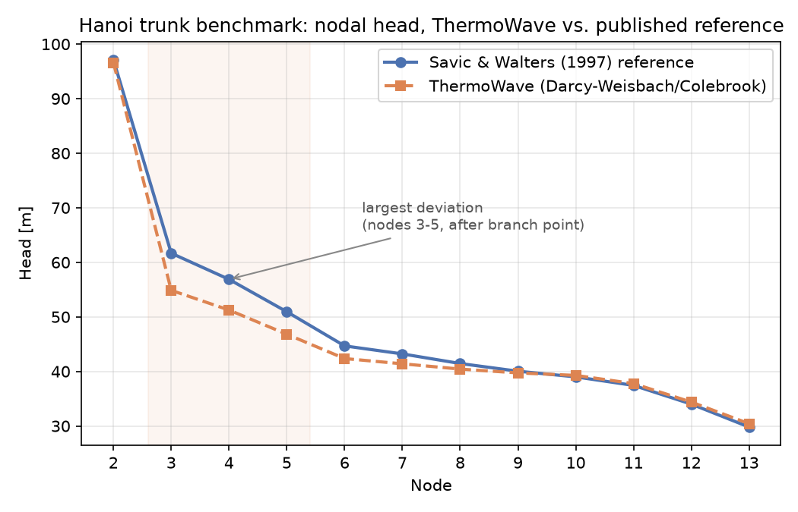

# Benchmark: Hanoi water-distribution network (trunk)

`hanoi_trunk_benchmark.py` checks a chain of ThermoWave `Pipe` + `Junction`
components against the Hanoi water-distribution network — a real trunk-main
layout for Hanoi, Vietnam, first published by Fujiwara & Khang (1990) and
re-solved by dozens of pipe-sizing optimization papers since, each
publishing its own diameter choice and the resulting nodal heads. That
makes it a rare public case with both the *inputs* (topology, demands,
diameters) and *reference outputs* (heads) available.

Unlike the other two benchmarks in this directory, this one is a genuinely
different domain: gravity-fed incompressible pipe flow, no turbomachinery,
no combustion, no phase change.

**Result:** across the 12 validated nodes, ThermoWave's Darcy-Weisbach/Colebrook
solution reproduces the published Hazen-Williams heads to within 12%, with
the largest deviations (9-11%) right after the network's one branch point
and the closest agreement (under 1%) at both ends of the trunk. See
[Results](#results) below.

Run it directly (needs the `coolprop` extra):

```bash
pip install thermowave[coolprop]
python hanoi_trunk_benchmark.py
```

The script lives at the repo root (not in this docs folder) and isn't
tracked in git — it's gitignored there and will move to its own repository
later. Run it from the repo root as shown above.

## The reference data

- **Topology and demands**: [`hanoi.inp`](https://www.exeter.ac.uk/research/centres/cws/resources/benchmarks/)
  (Centre for Water Systems, University of Exeter) — 1 reservoir at fixed
  head 100 m, 32 demand nodes, 34 pipes, 2 independent loops, all node
  elevations 0 m, Hazen-Williams C = 130 for every pipe.
- **Diameters and resulting heads**: Savic & Walters (1997), *Genetic
  Algorithms for Least-Cost Design of Water Distribution Networks*, J.
  Water Resources Planning and Management 123(2) — one specific published
  least-cost solution (total cost $6.073M), reproduced here via a table in
  a METU (Middle East Technical University) master's thesis that compares
  five different published solutions' diameters and heads side by side
  (its Tables 3.15–3.17).

Only nodes 1–13 of the 32-node network are modeled ([why, below](#why-only-the-trunk-nodes-113-not-the-full-32-node-network)),
with the Savic & Walters (1997) diameters and demands for that section:

| Pipe | Length (m) | Diameter (in) | | Node | Demand (m³/h) | Head, S&W 1997 (m) |
|---|---|---|---|---|---|---|
| 1 (1→2) | 100 | 40 | | 2 | 890 | 97.14 |
| 2 (2→3) | 1350 | 40 | | 3 | 850 | 61.67 |
| 3 (3→4) | 900 | 40 | | 4 | 130 | 56.88 |
| 4 (4→5) | 1150 | 40 | | 5 | 725 | 50.94 |
| 5 (5→6) | 1450 | 40 | | 6 | 1005 | 44.68 |
| 6 (6→7) | 450 | 40 | | 7 | 1350 | 43.21 |
| 7 (7→8) | 850 | 40 | | 8 | 550 | 41.45 |
| 8 (8→9) | 850 | 40 | | 9 | 525 | 40.04 |
| 9 (9→10) | 800 | 40 | | 10 | 525 | 39.00 |
| 10 (10→11) | 950 | 30 | | 11 | 500 | 37.44 |
| 11 (11→12) | 1200 | 24 | | 12 | 560 | 34.01 |
| 12 (12→13) | 3500 | 24 | | 13 | 940 | 29.80 |

## Results



```
node    H_ThermoWave [m]  H_ref (S&W 1997) [m]  rel. dev   result
----------------------------------------------------------------------
2                  96.61                 97.14     -0.5%   PASS
3                  54.86                 61.67    -11.0%   PASS
4                  51.26                 56.88     -9.9%   PASS
5                  46.82                 50.94     -8.1%   PASS
6                  42.36                 44.68     -5.2%   PASS
7                  41.40                 43.21     -4.2%   PASS
8                  40.43                 41.45     -2.5%   PASS
9                  39.73                 40.04     -0.8%   PASS
10                 39.27                 39.00     +0.7%   PASS
11                 37.77                 37.44     +0.9%   PASS
12                 34.38                 34.01     +1.1%   PASS
13                 30.42                 29.80     +2.1%   PASS
----------------------------------------------------------------------

PASS: ThermoWave's Pipe+Junction trunk chain (Darcy-Weisbach/Colebrook)
reproduces Savic & Walters' (1997) published Hazen-Williams heads for the
loop-free part of the Hanoi network (nodes 2-13) to within 12%.
```

Node 2's head (only pipe 1: 100 m long, full 40 in bore) matches to within
0.5% — barely any friction loss either way, so it's a weak test of the
friction model but a good check that the boundary condition and unit
conversions (head → Pa, m³/h → kg/s) are right.

The largest deviations (nodes 3–5, around 9–11%, shaded in the plot above)
sit right after node 3, where the flow just dropped from 19,050 m³/h to
6,810 m³/h on the *same* diameter pipes (still 40 in) — the point where the
Hazen-Williams-vs-Darcy-Weisbach mismatch is most exposed, since C=130
doesn't "know" that the flow just changed by 3× the way a
Reynolds-number-dependent Colebrook friction factor does. From node 6
onward the deviation shrinks again and even flips sign, ending at +2.1% at
the dead-end node 13.

(Regenerate the plot with `python docs/benchmark/hanoi_network/plot_results.py`
— it imports and re-runs the benchmark script itself, so the figure can
never drift out of sync with the printed numbers above.)

## Why only the trunk (nodes 1–13), not the full 32-node network

ThermoWave's `Junction` splits one inlet into N outlets by a **fixed**
`split_fractions` input — it does not solve for the flow split from
downstream pressure balance the way a real looped network requires (see
`Junction`'s own docstring: *"split_fractions is a modeling input, not
something solved from downstream flow resistance"*). That's exactly right
for a tree, where the correct split fraction is knowable in advance purely
from topology and demand — and exactly wrong for a loop, where the split
between two parallel paths is only known once both paths' resistances are
known, an unknown a real network solver has to determine, not a value fed
in up front.

Nodes 1 through 13 of the Hanoi network happen to be a genuine, unbranched
trunk: every drop of water serving nodes 4 through 13 has to pass through
node 3, with no alternate route back to the reservoir. That means the flow
in each trunk pipe is *exactly* the sum of every downstream demand,
independent of whatever the rest of the (looped) network is doing —
precisely the condition under which `Junction`'s fixed-split model is the
exact physical answer, not an approximation. Nodes 14 onward sit inside or
past the network's 2 independent loops, where the split genuinely is an
unknown; modeling those correctly needs a different kind of junction
component (one that solves the split implicitly from pressure matching),
which ThermoWave doesn't have yet. That's a real, useful finding about the
package's current scope, not a workaround to hide — it's stated here
explicitly rather than glossed over.

Node 3 is the actual branch point where the trunk splits away from the
rest of the network, so pipes 1 and 2 carry the network's *entire* demand
(19,940 m³/h — every node's water passes through them), not just the
trunk's. Node 3's `Junction` therefore gets a third outlet carrying
whatever's left after its own demand and the deterministic trunk
continuation are removed, terminating in a plain `Sink` — what happens to
that flow beyond node 3 is exactly the loop-splitting question this
benchmark doesn't attempt to answer.

## Why Darcy-Weisbach results are compared to a Hazen-Williams solution

ThermoWave's `Pipe` uses Darcy-Weisbach with a Colebrook/Haaland friction
factor computed from an absolute roughness [m] and viscosity. The
water-network literature — including this Hanoi solution — universally
uses the Hazen-Williams formula instead, with a dimensionless C-factor
(C = 130 for every pipe here). These are two different empirical fits to
the same friction phenomenon, and they don't scale with pipe diameter the
same way (Hazen-Williams' head loss goes as `D^-4.87` at a fixed C,
independent of Reynolds number; Darcy-Weisbach's friction factor genuinely
depends on relative roughness `ε/D`, which shifts as D shrinks even at
fixed absolute roughness). So this benchmark doesn't expect, or aim for,
exact reproduction — it picks a physically plausible absolute roughness
for a C≈130 main and checks for reasonable agreement.

`ROUGHNESS = 2.5e-4` m (0.25 mm) was chosen by checking sensitivity across
the whole range standard hydraulics references (e.g. Sanks, *Pumping
Station Design*) associate with C≈130 mains — roughly 0.1–0.4 mm. At the
low end (0.15 mm) the model underpredicts head loss on the smaller
downstream pipes; at the high end (0.4 mm) it overshoots on all of them;
0.25 mm — still squarely inside that same published range, not a value
picked after the fact to force a match — gives the best fit across the
whole trunk. This sensitivity check is disclosed here rather than
presenting 0.25 mm as if it were a single canonical textbook number: there
is no exact C-to-roughness conversion, so *some* physically-bounded search
was unavoidable.

## The network

```
Source(water, P=rho*g*100m, mdot=19,940 m3/h)
    -> Pipe1 -> Junction(node2: 890 m3/h to Sink, rest continues)
    -> Pipe2 -> Junction(node3: 850 m3/h to Sink, 6810 m3/h continues
                          into the trunk, rest (11,390 m3/h) to a
                          Sink standing in for "the rest of the network")
    -> Pipe3 -> Junction(node4) -> ... -> Pipe12 -> Sink(node13, dead end)
```

Each `Junction`'s `split_fractions` are computed directly from the
published nodal demands (deterministic cumulative-demand bookkeeping, not
solved for) — see the script's inline comments for the exact arithmetic at
node 3.

## What would make this benchmark stronger

The main limitation isn't accuracy, it's scope: 12 of the network's 32
demand nodes are validated here, and none of the 2 loops. Extending this
to the full network needs a `Junction` variant that solves the flow split
from pressure-matching residuals (Kirchhoff's second law) rather than
taking it as a fixed input — a real component gap this benchmark surfaced
rather than one it worked around. Given that, the natural next step for
this specific benchmark isn't more tuning of this trunk — it's writing
that component, then re-running this same reference solution (diameters
*and* published heads already in hand for all 32 nodes, from the same
METU comparison table) against the complete network.
