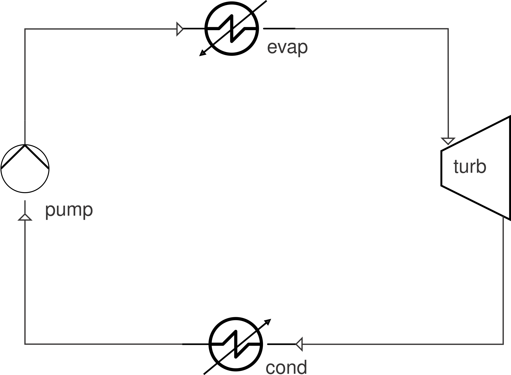

# Benchmark: 11 kWe ORC waste-heat-recovery rig

`orc11kwe_benchmark.py` checks ThermoWave's closed
`Pump -> SimpleEvaporator -> SteamTurbine -> SimpleCondenser` loop against a
published, instrumented 11 kWe organic Rankine cycle (ORC) test rig — R245fa
working fluid, plate heat exchangers, screw expander at a fixed 5000 rpm —
built and characterized under the ORCNext project.

**Result:** at both ends of the rig's published operating envelope,
ThermoWave's computed evaporator working-fluid duty lands well inside the
paper's own ±5% heat-balance closure band — −3.3% low-flow/low-temperature,
+1.3% high-flow/high-temperature — against the oil-side duty implied by
the paper's own Table 5:


The script and its plotting code live in their own standalone repo:
https://github.com/karimialii/orc11kwe-benchmark

```bash
git clone https://github.com/karimialii/orc11kwe-benchmark
cd orc11kwe-benchmark
pip install thermowave[coolprop]
python orc11kwe_benchmark.py
```

The chart above is regenerated by `plot_results.py`, which lives alongside
the benchmark script in that repo (see [below](#results)).

## The reference data

The paper reports the *achieved operating envelope* across a two-level
design of experiments — heat-source mass flow rate at 1.5 kg/s or 3.0 kg/s,
crossed with heat-source inlet temperature at 110 °C or 120 °C — as a
min/max range table (their Table 5):

| Variable | Min. value | Max. value |
|---|---|---|
| ṁ_hf (kg/s) | 1.495 | 3.006 |
| T_hf,in (°C) | 110.0 | 120.0 |
| T_hf,out (°C) | 83.0 | 103.4 |
| p_evap (bar) | 9.510 | 12.457 |
| p_cond (bar) | 2.148 | 2.771 |
| T_superheat (°C) | 19.8 | 21.1 |
| ṁ_wf (kg/s) | 0.2902 | 0.3874 |

Source: *Organic Rankine Cycle Part-Load Characterization: Validated Models
of an 11 kWe ORC*, University of Pretoria repository (ORCNext project
dataset), Table 5.

**On the pressure labels:** the source PDF's text extraction mangled both
pressure variables' subscripts to the same characters (a Unicode-subscript
font rendering artifact, not a mistake in the paper itself). The magnitudes
resolve the ambiguity on their own: R245fa's saturation pressure at
100–120 °C (the evaporator's temperature range) falls in the 9–12 bar
band, and at a plausible 25–35 °C condenser-cooling-water temperature
falls in the 2–3 bar band. So the second column here is read as the
**condensing** pressure, not a second evaporator-side reading. This script
carries that inference explicitly rather than silently guessing.

The two table columns are treated as the two extreme corners of the paper's
own 2×2 DOE (low-flow/low-temperature vs. high-flow/high-temperature) — a
reasonable pairing given how the DOE is described in the surrounding text,
though Table 5 itself only states them as the overall achieved min/max
range across all logged points, not as two individually tied rows. That
reading is the benchmark's own assumption, not something asserted by the
paper.

## What this benchmark checks, and what it deliberately doesn't

The paper validates net electrical power to within ±2%, and separately
validates evaporator/condenser heat-balance closure (primary-side duty vs.
secondary-side duty) to within ±5% — but both of those numbers live in
scatter plots (their Figures 5–9), not in a table, and the paper's own
pump/expander isentropic efficiencies aren't in the excerpt available here
either. Chasing the ±2% net-power figure without those efficiencies would
mean picking numbers to hit a target — fitting, not validation — so this
script doesn't attempt it. There's no `orc11kwe`-flavored expander
component check here for the same reason.

What *is* fully grounded in Table 5, with no invented numbers, is the
**evaporator heat balance**: the heat-source (Therminol 66 thermal oil)
duty implied by its published `ṁ_hf`, `T_hf,in`, `T_hf,out`, versus the
working-fluid-side duty ThermoWave computes for the same evaporator from
`ṁ_wf`, `p_evap`, and `T_superheat`. Comparing those two against the
paper's own claimed ±5% closure band is a real, citable check — it's
exactly the case the paper's own Figures 8–9 make for their model, just
computed independently here from the table instead of read off their plot.

The oil-side duty needs the oil's specific heat, which isn't in the excerpt
of the ORC paper used here; it comes from Eastman's own published
Therminol 66 correlation instead (see `therminol66_cp()` in the script,
sourced from Eastman technical bulletin TF-8695) — a legitimate, citable
number, just from a different public source than the ORC paper.

Two genuinely *assumed* (neither published nor derived) numbers appear:
`PUMP_ETA_ASSUMED = 0.75` and `TURBINE_ETA_ASSUMED = 0.75`. The pump one
barely matters: pump work for a liquid is `dh ≈ v·dP / eta`, and across
this cycle's pressure rise that's a few hundred J/kg against an evaporator
duty of roughly 2×10⁵ J/kg — under 1% of the quantity actually being
checked. It's included so the network models a physically complete
pump-to-evaporator chain rather than silently skipping the pump.

`TURBINE_ETA_ASSUMED` exists for a different reason: it's what lets the
cycle be wired as a genuinely closed loop (see below) rather than the open
`Source`/`Sink` chain this benchmark used to stop at the evaporator outlet.
It has **no effect** on the evaporator heat-balance check below — `Q_wf` is
computed from the pump-inlet and evaporator-outlet states alone, exactly as
before — but unlike the pump's efficiency, it *would* matter a great deal
for a net-electrical-power check (turbine work dominates the cycle's power
balance). No numeric net-power target is available from the paper excerpt
used here (see above), so this benchmark doesn't attempt that comparison;
neither assumed efficiency should be mistaken for a validated figure.

## The network



```
Pump(P_out=p_evap, eta=0.75)             # PUMP_ETA_ASSUMED, see above
    -> SimpleEvaporator(superheat=T_superheat)
    -> SteamTurbine(P_out=p_cond, eta_s=0.75)   # TURBINE_ETA_ASSUMED, see above
    -> SimpleCondenser(subcool=0.5 K)
    -> Recycle(mdot=mdot_wf)              # closes the loop back to Pump.in
    -> (back to Pump)
```

This is a genuinely closed loop — no `Source`, no `Sink`. `SimpleCondenser`
computes its own outlet `(P, h)` from a 0.5 K subcool target (the same
numerical-safety margin a `Source`-fixed pump-inlet temperature used to
apply directly), so the pump-inlet state is a *solved consequence* of the
condenser's own physics rather than an externally asserted boundary value.
`Recycle` supplies the one thing that's still missing without a `Source`
anywhere in the loop: an anchor for the working-fluid mass-flow rate's
magnitude (see [`Recycle`](../../components/flow-elements/recycle.md)).
Closing the loop this way reproduces the exact same evaporator-side
numbers this benchmark reported before (`Q_wf` unchanged to the last
digit) — the pump-inlet state was already physically equivalent to what
the condenser now computes; the difference is that it's now a genuine
model consequence instead of an assumption baked into `Source`'s own `T`.

`Pump` raises the pressure to `p_evap` (`Pump` is entropy-based —
`s_in = entropy_ph(...)`, `h_out_isentropic = enthalpy_ps(...)`, scaled by
`eta` — the correct real-liquid model, unlike a gamma-relation compressor).

`SimpleEvaporator` boils and superheats the working fluid at (effectively)
constant pressure up to `T_sat(p_evap) + T_superheat`, using the published
superheat value directly. `Q = mdot * (h_out - h_in)` for this component is
exactly the working-fluid-side duty this benchmark reports as `Q_wf`.

## Results

```
case                                       Q_wf [kW]  Q_oil [kW]  rel. dev   result
------------------------------------------------------------------------------------------
low (mdot_hf~1.5 kg/s, T_hf,in=110 C)          71.18       73.63     -3.3%   PASS
high (mdot_hf~3.0 kg/s, T_hf,in=120 C)         94.86       93.67     +1.3%   PASS
------------------------------------------------------------------------------------------

PASS: ThermoWave's evaporator-side duty (Source -> Pump -> SimpleEvaporator)
matches the oil-side duty implied by the published mdot_hf/T_hf,in/T_hf,out
to within the paper's own reported +/-5% heat-balance closure band, at both
ends of the published operating envelope.
```

The chart at the top of this page shows the same two numbers side by side:
`Q_wf` (blue, ThermoWave's working-fluid-side duty) against `Q_oil`
(orange, the oil-side duty implied by Table 5's `ṁ_hf`/`T_hf,in`/`T_hf,out`),
with the paper's own ±5% closure band drawn as dashed reference lines around
each `Q_oil` bar. Both bars land inside their band at both operating points.

This isn't a tuned fit: nothing here was adjusted to hit that number;
`p_evap`, `T_superheat`, and `ṁ_wf` come straight from Table 5, and the
oil-side duty comes straight from Table 5's `ṁ_hf`/`T_hf` values plus
Eastman's own Therminol 66 property correlation.

The chart is generated by `plot_results.py` in the [benchmark's own
repo](https://github.com/karimialii/orc11kwe-benchmark), which re-runs the
same network + oil-duty calculation as `orc11kwe_benchmark.py` (by
importing it directly) rather than hardcoding the numbers above, so it
can't silently drift out of sync with the benchmark script:

```bash
pip install thermowave[coolprop,plot]
python plot_results.py
```

## What would make this benchmark stronger

Digitizing the paper's Figures 5–9 (or getting the underlying numeric log
rather than a plot) would unlock two things this script can't do yet:

1. **A matched single operating point.** Table 5's columns are the overall
   achieved *range*, not two specific tied-together readings — treating
   them as the two DOE corners is a reasonable but unverified assumption.
   A single logged data row would remove that assumption entirely.
2. **A net-power check.** The network is now a genuinely closed loop
   (`SteamTurbine` + `SimpleCondenser` + `Recycle`, see above) — the
   topology needed for a net-power check already exists. What's still
   missing is a published (or back-calculated) expander isentropic
   efficiency to replace `TURBINE_ETA_ASSUMED` with, and a digitized
   net-power target from the paper's Figures 5–9 to check against.
