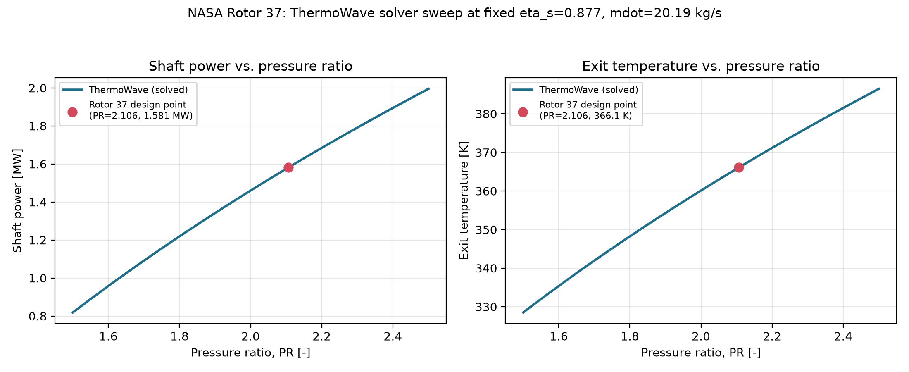

# Benchmark: NASA Rotor 37

`rotor37_benchmark.py` checks ThermoWave's `SimpleCompressor` against the
published design point of NASA Rotor 37, a transonic axial compressor rotor
that has served as an open turbomachinery CFD validation case since the
1994 IGTI blind test. ThermoWave's solved exit temperature and shaft power
agree with a hand calculation from NASA's published (PR, eta_s) to machine
precision (~1e-16 relative error) — confirming `SimpleCompressor`'s
residual equations encode the isentropic-efficiency relation correctly. A
pressure-ratio sweep (below) then shows where that single design point
sits on the compressor's broader operating range.

Run it directly, no optional extras required:

```bash
python rotor37_benchmark.py
```

The script lives at the repo root and isn't tracked in git (gitignored —
it'll move to its own repo later); run it from the ThermoWave repo root as
shown above.

## The reference data

NASA Rotor 37 was designed and tested by Reid and Moore at NASA Lewis
(now Glenn Research Center) as the inlet stage of an eight-stage,
20:1-pressure-ratio core compressor, then retested in isolation so it could
be used as a standalone CFD test case. Its design-point aero-thermodynamics
are public:

| Quantity | Value |
|---|---|
| Design mass flow | 20.19 kg/s |
| Total pressure ratio | 2.106 |
| Adiabatic efficiency | 0.877 (87.7%) |
| Rotational speed | 17,188.7 rpm |
| Rotor tip speed | 454.14 m/s |
| Inlet total pressure (standard day) | 101,325 Pa |
| Inlet total temperature (standard day) | 288.15 K |

Source: Ameri, *NASA Rotor 37 CFD Code Validation — Glenn-HT Code*,
NASA/CR—2010-216235 (AIAA-2009-1060), Table I — design parameters
reproduced from Suder, NASA TM 107310 (1994).

## What this benchmark checks, and what it deliberately doesn't

NASA's own validation of Rotor 37 is 3D CFD compared against blade-resolved
flow-field measurements: spanwise total-pressure and total-temperature
profiles, tip-vortex structure, exit flow angle, and a choke-to-stall map
of exit pressure rise vs. mass flow. None of that is reproducible by a 1D
network solver, and this benchmark doesn't try to.

What a 1D solver *can* check is the aero-thermodynamic bookkeeping around
the rotor: given its published pressure ratio and efficiency at the design
mass flow and inlet state, does the standard isentropic-compression-with-
efficiency relation — the one `SimpleCompressor` implements — reproduce the
exit temperature and shaft power implied by those same published numbers?

That's what the script does: it hand-computes the expected exit state from
the textbook relations,

```
T2s        = T1 * PR ** ((gamma - 1) / gamma)      # isentropic exit temp
dT_actual  = (T2s - T1) / eta_s                     # efficiency definition
power      = mdot * cp * dT_actual
```

and compares that against ThermoWave's own converged network solution.
Framed this way, it's really a self-consistency check on `SimpleCompressor`'s
residual equations, anchored to a real, published operating point rather
than an arbitrary one — not a claim that ThermoWave reproduces Rotor 37's
internal flow field.

## The network

```
Source(air, P=101325 Pa, T=288.15 K, mdot=20.19 kg/s)
    -> SimpleCompressor(PR=2.106, eta_s=0.877, gamma=1.4)
    -> Sink()
```

`Source` fixes the rotor's published design-point inlet state and mass
flow directly (standard-day total conditions, the rig's own reference
condition). `SimpleCompressor` is ThermoWave's analytic (map-free)
compressor: fixed `PR` and isentropic efficiency `eta_s`, with the actual
enthalpy rise computed from the isentropic relation divided by `eta_s`
(the standard adiabatic-irreversible-compression model — see
`SimpleCompressor`'s docstring). `Sink()` with no `P` given just closes the
network, absorbing whatever state balancing that mass flow through the
compressor produces.

`gamma=1.4` is passed explicitly here to match the "textbook ideal-gas"
hand calculation term for term. Left as `None`, `SimpleCompressor` would
instead derive gamma from the fluid model itself (`IdealGasFluid.gamma()`,
which is `cp / (cp - R)` for a constant-cp gas) — for `R=287.05`,
`cp=1005.0` that's gamma = 1.3997, indistinguishable at the precision
these numbers are published to, but the explicit value keeps the hand
calculation exact rather than "exact to four decimal places."

## Results

```
component  │     power [W]│     eta_s [-]│        PR [-]│   N [rev/min]
rotor37    │     1.581e+06│         0.877│         2.106│             -

node         │        P [Pa]│         T [K]│      h [J/kg]│   mdot [kg/s]
src.out      │     101325.00│        288.15│     289590.75│       20.1900
rotor37.out  │     213390.45│        366.06│     367893.78│       20.1900

quantity                         ThermoWave      hand calc   units
PR                                   2.1060         2.1060       -
eta_s                                0.8770         0.8770       -
T_out                               366.063        366.063       K
power                                1.5809         1.5809      MW

PASS: ThermoWave's SimpleCompressor reproduces the design-point
thermodynamics implied by NASA Rotor 37's published (PR, eta_s)
to within 1e-06 relative error.
```

The solved and hand-calculated values agree to machine precision (relative
error ~1e-16), as expected — both sides are evaluating the exact same
closed-form relation, just once inside the Newton solve and once outside
it. That's the point of the check: it isn't testing numerical accuracy,
it's testing that `SimpleCompressor`'s residuals encode the relation
correctly, with no sign error, no unit mixup, and no silent fallback to
the wrong `gamma`.

The absorbed shaft power, 1.581 MW at the design mass flow, is a
reasonable, independently useful number: it's the actual work Rotor 37
does on the air at its design point, derivable from NASA's own published
(PR, eta_s, mdot) without needing anything ThermoWave-specific — a good
sanity figure to keep in mind for a rotor of this size and pressure ratio.

## The design point in context: a pressure-ratio sweep

A single-point agreement check like the one above is, by construction, a
thin thing to look at on its own — both sides are evaluating the same
formula, so of course they match. What that number doesn't show is *where*
Rotor 37's design point sits relative to the compressor's broader operating
range.

`plot_results.py` (same directory as this file) fills that gap. It builds
and solves a fresh ThermoWave network — through the actual solver, not the
hand-calc formula — at 41 pressure ratios spanning 1.5 to 2.5, holding
`eta_s`, inlet state, and mass flow at their published design values, and
records the solved shaft power and exit temperature at each point:

```bash
python docs/benchmark/rotor37/plot_results.py
```



Both curves are smooth and monotonic in PR, as expected from the
isentropic relation with fixed `eta_s`, and the NASA design point
(PR = 2.106, marked in red) sits in the middle of the swept range rather
than at an edge — i.e., it's an unremarkable, well-behaved operating
condition for the model, not a corner case. This doesn't validate anything
beyond what the single-point check already does (it's the same relation,
just evaluated at more points); what it adds is the shape of the
power/temperature response around the design point, which the single
number alone can't convey.

## Why there's no map-based validation here

ThermoWave also has `thermowave.components.Compressor`, which reads `PR`
and `eta_s` off digitized iso-speed characteristic curves instead of fixed
constants — the natural next step for a compressor benchmark, since Rotor
37 does have a real map (exit pressure rise vs. normalized mass flow,
swept from choke to stall). It isn't used here because NASA/CR—2010-216235
only presents that sweep as a plotted figure (Figure 6), not a digitized
table — building a `.cop` map file from it would mean reading points off a
plot by eye rather than using published numbers directly, which is a
different (and much noisier) kind of benchmark than the one this script
does. Digitizing that figure, or sourcing the underlying numeric table
from Suder's original NASA TM 107310, is the natural way to extend this
benchmark to `Compressor` and multi-speed-line map behavior.
