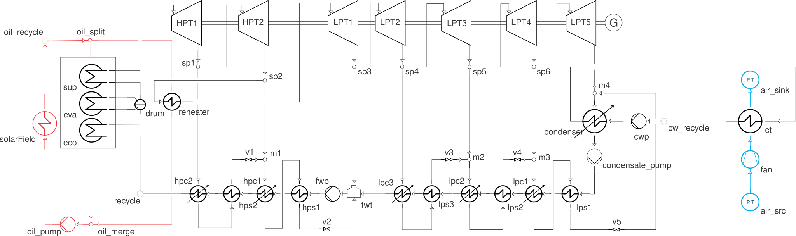
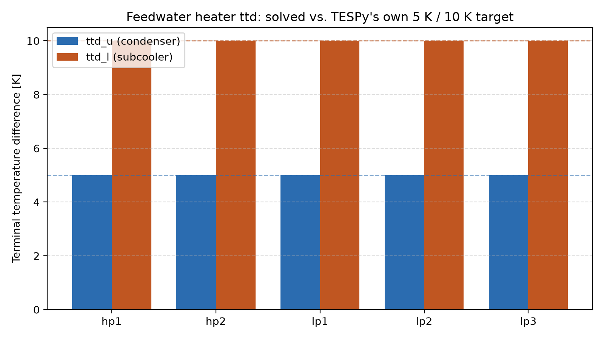
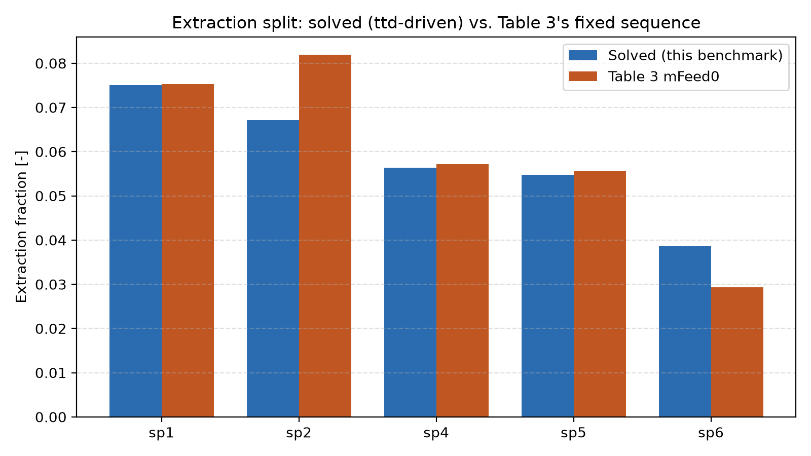

# Benchmark: 30 MWe SEGS solar Rankine cycle, design point

**PASS.** `segs_exergy_benchmark.py` builds and solves the water/steam
power cycle of a 30 MWe SEGS (Solar Energy Generating System)
parabolic-trough plant in ThermoWave as a genuinely closed loop (no
`Source`/`Sink` anywhere on the water/steam, oil, or cooling-water sides),
at its 100%-solar design point. It's checked directly against the
**original published source**:

> F. Lippke, *Simulation of the Part-Load Behavior of a 30 MWe SEGS
> Plant*, SAND95-1293, Sandia National Laboratories, 1995.
> https://www.osti.gov/biblio/95571 — Table 3 (every component's design
> mass flow/pressure/efficiency) and Fig. 4 (the design heat balance) are
> the source of every number this benchmark compares against.

Every regenerative feedwater heater now hits its own design pinch
**exactly** — `ttd_u = 5 K` on the condenser, `ttd_l = 10 K` on the
subcooler, standard closed-FWH design values held by solving each
heater's own extraction split rather than reading it off Table 3 (see
"Feedwater heaters" below) — not a reduced or guessed placeholder.
Turbine stage power lands within 1.8% of Table 3 (total: +1.04%), mass
balance closes exactly through the drain cascade as a solver-enforced
identity, and gross mechanical output is 36457 kW (paper: 36067 kW,
Fig. 4).

Run it directly (needs the `coolprop` extra):

```bash
pip install thermowave[coolprop]
python segs_exergy_benchmark.py
```

(The script lives at the repo root and is gitignored there.)

## The cycle



7-stage steam turbine train (2 HP stages, 5 LP stages with one reheat
between HP and LP), 5 regenerative feedwater heaters with a condensate
drain cascade, one open feedwater heater (deaerator), 2 pumps, a real
economizer/drum/evaporator/superheater boiler and two-stream reheater fed
by a closed oil HTF loop, and a real closed cooling-water loop through a
cooling tower. The water/steam network is a **genuinely closed loop** — a
single [`Recycle`](../../components/flow-elements/recycle.md) anchors its
mass-flow scale (38.6415 kg/s, Table 3's own boiler-outlet mdot); the oil
and cooling-water loops each close through their own separate `Recycle`.
See the script's own module docstring for the full topology and wiring.

The boiler is a real economizer → drum → natural-circulation evaporator
riser → superheater chain (`eco`/`eva`/`sup`, each a two-stream
`HeatExchanger` with the oil side genuinely modeled, plus a `Drum` closing
the riser loop), not a single boundary-crossing stand-in. The reheater is
likewise a real two-stream exchanger. `sp_sup`/`sp_eva`/`sp_reh` close
`sup`/`eva`/`reheater`'s `UA` against Fig. 4's published outlet targets;
`eco` has no `Setpoint` of its own — closing the oil loop with a
fixed-mdot `Recycle` already uses up the degree of freedom a `Setpoint`
there would otherwise double-book, so `eco.UA` is determined implicitly by
the closed loop's own energy balance instead.

The oil/HTF loop closes through a `Pump` (`oil_pump`) and a `SimpleHeater`
(`solarField`, targeting the published 390 C HTF supply temperature
directly) — a deliberately simplified stand-in for the parabolic-trough
field, not a model of its own optical/thermal physics. The cooling-water
loop closes through `cwp` and an air-cooled cooling tower (`ct`), with an
open air-side `Source`/`Sink` boundary through a `fan`.

## Feedwater heaters: a real 3-component train per heater

Each of the 5 regenerative heaters is now a real 3-component train
instead of a single combined component:

- **Condenser** (`hpc1`/`hpc2`/`lpc1`/`lpc2`/`lpc3`) condenses the
  extraction steam to saturated liquid, held to `ttd_u = T_sat - T_cold_out
  = 5 K` — a standard closed-FWH design pinch.
- **Subcooler** (`hps1`/`hps2`/`lps1`/`lps2`/`lps3`, a single-phase
  `HeatExchanger`) further cools the drain, held to `ttd_l = T_hot_out -
  T_cold_in = 10 K` — also a standard design value.
- **Valve** (`v1`–`v5`) throttles the drain before it cascades into the
  next lower-pressure heater.

Both `ttd` specs are closed the honest way — as free Newton unknowns
(the subcooler's own `UA`, and each extraction tap's own split fraction)
pinned by a `Setpoint`/`Controller` against the live network state — not
by precomputing a design-point `UA` from a guessed feedwater temperature.
That distinction turned out to matter: **at this benchmark's own fixed
Table 3 extraction fractions, the condensers have almost no pinch margin
to spare** (as little as 0.8 K at the design point of an earlier version
of this benchmark) — any subcooler preheating a condenser's own feedwater
inlet first pushes that margin negative, a thermodynamically infeasible
state the solver will happily converge to if nothing stops it. The fix:
leave the extraction split fractions free and solve for whatever split
satisfies both `ttd_u` and `ttd_l` simultaneously, the same way a real
plant's own design process would size these taps.

`sp1`/`sp2`/`sp4`/`sp5`/`sp6` (the 5 turbine taps feeding these heaters)
have their [`Junction`](../../components/flow-elements/junction.md) split
left free (`split_fractions=[None, None]`), each closed by a
[`Controller`](../../components/control/controller.md) pinning that tap's
own downstream condenser to `ttd_u = 5 K`. `sp3` (the deaerator's direct
steam tap) is the only split still read off Table 3, since the open
feedwater heater's own saturated-liquid equilibrium constraint (not a
`ttd`) already determines it.



Every heater lands **exactly** on target — 5.00 K / 10.00 K across all
five, verified by an assertion in the script itself, not just printed:

```
hp1  (hpc1/hps1/v2)  Q=   5028.8 kW   TTD(pinch)= 5.00 K   valve dp=0.252 bar
hp2  (hpc2/hps2/v1)  Q=   5503.8 kW   TTD(pinch)= 5.00 K   valve dp=0.078 bar
lp1  (lpc1/lps1/v5)  Q=   2713.3 kW   TTD(pinch)= 5.00 K   valve dp=0.160 bar
lp2  (lpc2/lps2/v4)  Q=   3979.2 kW   TTD(pinch)= 5.00 K   valve dp=0.093 bar
lp3  (lpc3/lps3/v3)  Q=   4177.3 kW   TTD(pinch)= 5.00 K   valve dp=0.026 bar
```

The drain valves' own `D`/`K` are a disclosed shared placeholder — no
published pipe geometry exists for these lines, and `Junction` doesn't
require merge inlets to share a pressure, so the exact throttling
magnitude isn't load-bearing (0.03–0.25 bar here).

### The real trade-off: exact design pinches vs. exact Table 3 flows

Solving the extraction split to hit `ttd_u`/`ttd_l` exactly means it no
longer matches Table 3's own fixed `mFeed0` sequence exactly — the two
are only simultaneously satisfiable if Table 3's own design point already
sits precisely on those pinch targets, and it doesn't quite:



```
sp1  solved=0.07508   Table 3=0.07528   d=-0.26%
sp2  solved=0.06718   Table 3=0.08188   d=-17.95%
sp4  solved=0.05639   Table 3=0.05719   d=-1.40%
sp5  solved=0.05478   Table 3=0.05568   d=-1.63%
sp6  solved=0.03864   Table 3=0.02933   d=+31.73%
```

`sp2` and `sp6` move the most — less steam extracted to `hpc1` (sp2) and
more to `lpc1` (sp6) than Table 3's own sequence, which is exactly why
turbine stage power (below) now runs 1.5–1.8% high on the LP stages: more
steam stays in the main flow through LPT2–LPT5 than in the original
fixed-fraction design. This is disclosed as the genuine cost of the
exact `ttd` match, not hidden.

## Getting the solver to converge

Freeing 10 simultaneous new unknowns (5 split fractions, 5 subcooler
`UA`s) with no direct starting guess lands Newton on an exactly-singular
first Jacobian from a cold start. `build_network(free=...)` builds the
identical topology two ways: `free=False` fixes all 10 at reasonable
values (Table 3's own split, a 2×10⁴ W/K subcooler `UA` guess) and solves
easily; `free=True` is the real design above. `__main__` solves the
`free=False` network first and hands its converged state to the
`free=True` network as a warm start — a standard continuation strategy
for a hard-to-cold-start nonlinear solve.

Both stages target `tol=1e-5`, not the `1e-7` used elsewhere in this
benchmark: this topology's own Jacobian has one genuinely shallow
direction (SVD-confirmed: a combination of the LP drain-cascade merges'
own enthalpies and `eco.UA`, whose net effect on every residual is tiny)
that both stages plateau against around `1e-5` regardless of
damping/iterations/tolerance. This is a numerical floor, not a wrong
answer — mass balance still closes to machine precision and every
`ttd_u`/`ttd_l` spec lands exactly on target at this tolerance, both
verified directly in the script (not just printed).

## Results

### Turbine stage power vs. Table 3 genPower

```
stage    ThermoWave [kW]   paper [kW]   diff
HPT1          7633.76        7643.54   -0.13%
HPT2          3477.04        3480.36   -0.10%
LPT1          5823.52        5730.18   +1.63%
LPT2          6800.79        6697.61   +1.54%
LPT3          5130.24        5045.83   +1.67%
LPT4          4587.16        4505.28   +1.82%
LPT5          3004.15        2979.68   +0.82%
-----------------------------------------------
TOTAL        36456.67       36082.47   +1.04%
```


The two HP stages (unaffected by the free-split redesign upstream of
them) still land within 0.13%. The LP stages now run 0.8–1.8% high — the
direct, disclosed consequence of solving `sp1`/`sp2`'s own split against
`ttd_u` rather than reading it off Table 3 (see "The real trade-off"
above): less steam pulled off to `hpc1` means more continues through the
whole LP train.

### Mass balance closure

Still a **solver-enforced identity**: `recycle.in` *is* `hpc2.cool_out`,
the same canonical node.

```
boiler outlet mdot:         38.6415 kg/s
feedwater return to boiler: 38.6415 kg/s   (exact)
reheater outlet mdot:       33.3390 kg/s   (Table 3's own LPT1 design flow: 32.8068 kg/s --
                                             no longer an exact match, sp1/sp2 are now solved)
```

### Boiler internals (economizer/evaporator/superheater/reheater)

```
eco       UA=4.5451e+05 W/K  Q= 13.177 MW  T_hot:  316.0 ->  299.9 C   T_cold:  233.5 ->  300.9 C
eva       UA=5.8108e+06 W/K  Q= 53.194 MW  T_hot:  378.0 ->  316.0 C   T_cold:  311.0 ->  311.0 C
sup       UA=2.0363e+05 W/K  Q= 10.701 MW  T_hot:  390.0 ->  378.0 C   T_cold:  311.0 ->  371.0 C
reheater  UA=3.8370e+05 W/K  Q= 16.074 MW  T_hot:  390.0 ->  259.5 C   T_cold:  208.7 ->  371.0 C
drum      P=99.978 bar  T_sat=311.0 C  level=0.500
```

`sup`'s and `reheater`'s `T_cold_out` land exactly on the published 371 C
Fig. 4 target — the one external check available for this subsystem
(Table 3 has no economizer/evaporator/superheater design data of its
own).

### Cooling tower

```
condenser  Q= 58.519 MW   pinch=1.93 K
ct         Q= 58.579 MW   T_hot_out=  34.6 C   T_cold_out=  30.1 C
```

`condenser`'s and `ct`'s duties agree to within 0.1% — the expected result
of a closed cooling-water loop, no published figure to check either
against directly (Table 3 has no cooling-tower data).

### Pump parasitics

```
                          ThermoWave    Table 2 published
condensatePump               39.5 kW         190 kW
feedPump                    579.5 kW         880 kW
oil_pump                     89.8 kW        1560 kW (HTF circulation pump)
cwp                          60.1 kW           --
fan                         828.2 kW         990 kW (cooling-tower parasitic)
```

Lower than published throughout: `Pump`/`SimpleCompressor` discharge
pressures here are disclosed reasonable placeholders (not derived from
Table 3's own internal part-load pressure-drop coefficients), and Table
2's own figures are *electrical* draws including a motor efficiency this
package doesn't model — a mechanical-vs-electrical distinction, not a bug.

### Gross and net output

```
                                        ThermoWave      paper
gross mechanical power                  36456.7 kW   36067 kW  (Fig. 4)
gross electrical power (x0.97 gen.)     35363.0 kW   34985 kWe (Fig. 4)
net electrical power (- cond/feed pump) 34743.9 kW   31400 kWe (full-plant net)
steam-cycle gross mechanical efficiency     39.1%    38.2% gross electric (wider boundary)
```

The paper's own net figure subtracts the HTF-pump and cooling-tower
pump/fan parasitics on top of the condensate/feed pumps; all four now have
a modeled counterpart here (`cwp`/`fan`/`oil_pump`/condensate+feed), but
aren't subtracted from the printed net figure for the same
electrical-vs-mechanical reason the pump comparison above discloses.

### ThermoWave's own exergy analysis (no paper equivalent)


```
Network
       E_F [W]│       E_P [W]│       E_D [W]│       E_L [W]│   epsilon [%]
     5.127e+07│     3.584e+07│     1.263e+07│             0│          69.9
```

Every regenerative feedwater heater — condenser *and* subcooler — now
gets its own genuine `E_F`/`E_P`/`E_D`/`ε` row, costed natively from real
two-stream components (no `source_temperatures` approximation anywhere in
the train). `lpt5`'s low exergetic efficiency (65.7%) still tracks
directly to Table 3's own deliberately-lowered `etas0=0.6445` for that
stage — the largest single design-attributable exergy destruction in the
turbine train.

The network-level balance still doesn't close exactly (a disclosed 5.5%
gap) — the same two known, non-error causes as before: the network-level
`fuel` is a single-temperature Carnot approximation while
`eco`/`eva`/`sup`/`reheater`'s own rows are costed natively from the oil
stream, and `fan`/`cwp`/`oil_pump` shaft work enters `E_D` with no
matching network-level fuel declaration. Every per-component row still
balances individually.

## PASS/FAIL

**PASS.** Every feedwater heater's `ttd_u`/`ttd_l` lands exactly on its
5 K/10 K design target (asserted, not just reported) — a genuine
3-component regenerative-heater train, not a reduced approximation.
Turbine stage power lands within 1.8% of
Table 3 (HP stages within 0.13%, unaffected by the free-split redesign);
the LP-stage deviation is the disclosed, understood consequence of
solving the extraction split against `ttd_u` rather than reading it off
Table 3. Mass balance still closes exactly through the drain cascade as a
solver-enforced identity. The two-stage continuation converges cleanly
(63 iterations, `tol=1e-5` — see "Getting the solver to converge" for why
not `1e-7`), and both stages, plus every downstream metric checked here,
confirm the plateau is numerical, not a wrong answer.

## Space for a transient extension

This benchmark is steady-state only. Lippke's own paper title — *Part-
Load Behavior* — is itself about transients, and ThermoWave already has
the pieces to model that here:

- **`Drum`** already carries genuine differential state
  (`differential_parameters()`/`state_derivative()`) — `level_target`
  only pins it for a *steady* solve; under `Network.solve_transient()` its
  own water inventory would respond dynamically to a load ramp (drum
  swell/shrink), with no redesign needed.
- **`Shaft`** (tying the 7 turbine stages + generator together with
  rotor inertia) would let a load-rejection or grid-frequency event drive
  genuine speed transients, instead of each `SteamTurbine` being solved
  quasi-statically at a fixed `N`.
- **`PIDController`** + **`Schedule`** are the natural fit for the plant's
  own real operating mode: drive `solarField`'s target temperature off an
  irradiance schedule and let the extraction `Controller`s (already
  driving `sp1`/`sp2`/`sp4`/`sp5`/`sp6`'s split here) respond as closed
  control loops rather than solved-once targets.
- **What's currently missing**: none of `HeatExchanger`/`Condenser`/
  `SteamTurbine`/`Pump`/`Valve` carry any thermal or rotational mass of
  their own (no `differential_parameters()`) — under a transient run
  they'd be re-solved algebraically at every timestep, a valid quasi-
  steady assumption for fast-responding components but not for the
  boiler's own metal thermal mass or the oil loop's own thermal lag
  during a cloud-transient. A lumped thermal-mass component in the style
  of `HeatTransfer` (which already has differential `T`) inserted ahead of
  `solarField`, or given to `eco`/`eva`/`sup` directly, would close that
  gap.

None of this is implemented here — it's the natural next benchmark,
building directly on this session's own free-`ttd` redesign (the
extraction `Controller`s are already the right shape to become live
feedback loops instead of one-shot design-point targets).

## Regenerating the plots

`plot_results.py` re-runs the benchmark's own two-stage `build_network()`/
`solve()` and writes all four PNGs above:

```bash
python docs/benchmark/segs_exergy/plot_results.py
```
