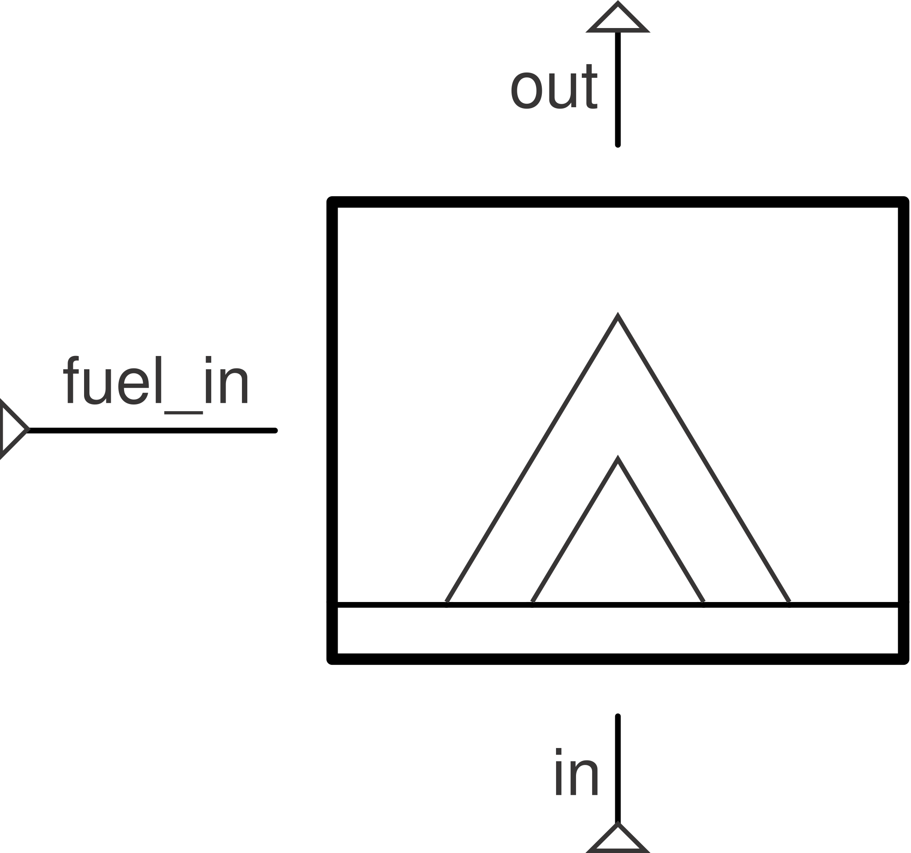

# Combustor

Uses [Cantera](https://cantera.org/) chemical-equilibrium combustion
products to find outlet temperature, instead of a fixed LHV (see
[`SimpleCombustor`](simple-combustor.md)). Requires the optional `cantera`
extra.

**Ports:** `in`, `out` (plus `fuel_in` if `use_fuel_port=True`, below)
&nbsp;·&nbsp; **Parameters:** `PR` (default 0.97),
`efficiency` (default 1.0), `mdot_fuel` (leave `None` to solve for it),
`fuel` (default `"CH4"`), `oxidizer` (default `"O2:0.21, N2:0.79"`),
`mechanism` (default `"gri30.yaml"`, GRI-Mech 3.0), `heat_path` (optional),
`use_fuel_port` (default `False`)

At residual-evaluation time, the inlet air and fuel are mixed by mass in the
ratio `mdot_fuel/mdot_in` and equilibrated at constant enthalpy and pressure
(`equilibrate("HP")`) — a standard adiabatic-flame-temperature calculation:

$$
T_\text{out,adiabatic} = \text{equilibrate}(T_\text{in}, P_\text{in}, \dot m_\text{air}, \dot m_\text{fuel})
$$

$$
T_\text{out,target} = T_\text{in} + \eta\,(T_\text{out,adiabatic} - T_\text{in})
$$

`efficiency` scales the temperature *rise* from the adiabatic result — a
simplified way to represent incomplete combustion or wall heat loss without
re-running the equilibrium at a different enthalpy.

$$
P_\text{out} - PR\cdot P_\text{in} = 0
\qquad
h_\text{out} - h(P_\text{out}, T_\text{out,target}) + \frac{Q_\text{loss}}{\dot m_\text{out}} = 0
$$

**`use_fuel_port`** — same idea as [`SimpleCombustor`](simple-combustor.md)'s
flag: `False` (default) mixes fuel (the `fuel` composition string) with the
air inlet at the air's own `(T_in, P_in)`, and `mdot_fuel` is a scalar
(fixed-or-free) parameter, not a port. `True` adds a genuine `fuel_in`
port — connect a real fuel-supply branch to it (`Source → Pipe →
combustor`); `mdot_fuel` is then read directly from that branch's own
solved flow, `mdot_fuel`/`free_parameters()` become no-ops, and two further
improvements apply on top of `SimpleCombustor`'s equivalent mode: if the
fuel port's resolved fluid is itself Cantera-flavored (exposes
`mass_fractions()`/`mechanism` — the same duck-typed check
[`Junction`](../flow-elements/junction.md)'s mixing uses), its actual
composition is used instead of the `fuel` string; and the fuel stream is
evaluated at its own connected `(P, h)` instead of the air inlet's.

**Composition propagation.** When the combustor's own inlet fluid is a
`CanteraFluid`, the reacted product composition feeds back into the network
via `outlet_fluid()` — every downstream component that reads
`NetworkState.fluid_at()` sees the real product mixture's density, enthalpy,
and `cp`, not plain air's. This is only physically consistent when the
inlet fluid already shares Cantera's absolute (formation-enthalpy-referenced)
datum, so for any other inlet fluid this falls back to pass-through:
chemistry-informed `T_out`, tracked downstream as if it were still the same
working fluid. Either way, `product_composition(state)` returns the full
equilibrium mole-fraction breakdown directly, and the major species (`CO2`,
`H2O`, `O2`, `N2`, plus `CO`/`NO` above a trace threshold) are surfaced in
`report_metrics()` as `"X_<species> [-]"`.

---
Part of [Combustion](index.md).
