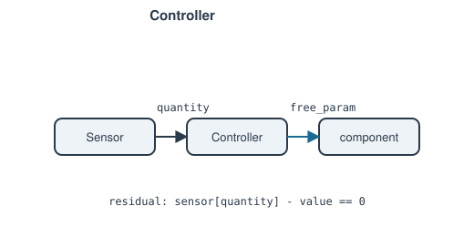

# Controller

Drives a component's free parameter until a [`Sensor`](sensor.md) reads a
target value — an ideal, infinite-gain controller with no dynamics,
appropriate for a steady operating point.

**Ports:** none &nbsp;·&nbsp; **Parameters:** `sensor`, `quantity`,
`component`, `free_param`, `value`

$$
\text{sensor.report\_metrics(state)[quantity]} - \text{value} = 0
$$

Same closed-loop idea as [`Setpoint`](setpoint.md), but where `Setpoint`
reads the *target component's own* metric, `Controller` reads an
independent `Sensor` elsewhere — mirroring a real control loop where the
measured and actuated quantities live in different places in the plant.
Raises `ValueError` at construction if the target component doesn't
currently declare `free_param` as free (a fast-failing check against a
mismatched Newton system discovered later).

For the time-domain, finite-response counterpart used in
`Network.solve_transient()`, see [`PIDController`](pid-controller.md).

---
Part of [Control & instrumentation](index.md).
