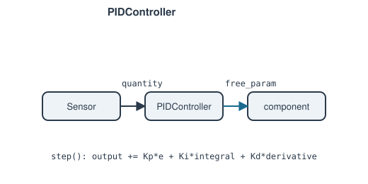

# PIDController

The finite-response, time-domain counterpart to [`Controller`](controller.md),
for use inside `Network.solve_transient()`.

**Ports:** none &nbsp;·&nbsp; **Parameters:** `sensor`, `quantity`,
`component`, `free_param`, `setpoint`, `Kp`, `Ki`, `Kd`, `output0`,
`output_min`/`output_max` (anti-windup clamps), `feedforward` (optional
callable)

Each algebraic solve pins `free_param` to the *current* `self.output` (one
residual, same shape as `Controller`'s):

$$
\text{state.param}(\text{free\_param}) - \text{self.output} = 0
$$

`self.output` only *changes* once per transient step, via `step()`:

$$
e = \text{setpoint} - \text{measured}
\qquad
\text{output} = \text{bias} + K_p e + K_i \!\int\! e\,dt + K_d \frac{de}{dt}
$$

clamped to `[output_min, output_max]` with clamped (anti-windup) integration
— the integral only keeps accumulating in the direction that isn't already
saturating. `output0` both seeds the very first solve and sets the fixed
`bias` every later output adds to, so `Kp`/`Ki`/`Kd` represent a small
correction around a known-reasonable operating point rather than having to
wind the integral up to that point's whole magnitude.

`feedforward(state) -> float` replaces the constant `bias` with one computed
fresh each step, so the operating point the PID trims around can *move*
with the plant — e.g. biasing a gas turbine's fuel governor from the
commanded load rather than a fixed reference, so the loop only ever trims a
small correction instead of having to integrate across the whole actuator
range to find the operating point (which can walk straight into a
no-equilibrium region on the way).

---
Part of [Control & instrumentation](index.md).
