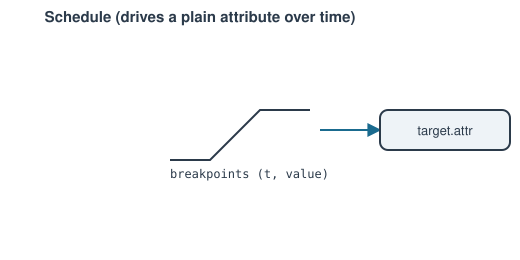

# Schedule

Drives a plain attribute on some other object (typically a
[`Controller`](controller.md)/[`PIDController`](pid-controller.md)'s
`setpoint`, or a `ShaftLoad`'s `power`) along a piecewise time profile
during `Network.solve_transient()`.

**Ports:** none &nbsp;·&nbsp; **Residuals:** none — not part of the Newton
system at all. **Parameters:** `target`, `attr`, `breakpoints` (list of
`(t, value)` pairs, strictly increasing `t`), `interpolation` (`"linear"`
default, or `"step"`)

$$
\text{value}(t) = \begin{cases}
v_0 + \dfrac{t-t_0}{t_1-t_0}(v_1-v_0) & \text{linear, } t_0 \le t < t_1 \\[4pt]
v_0 & \text{step, } t_0 \le t < t_1
\end{cases}
$$

held flat at the nearest endpoint value before the first/after the last
breakpoint. `step(state, dt)` is discovered and called once per accepted
timestep by `Network.solve_transient()` — the same hook `PIDController` uses
— replacing the common hand-written loop of manually reassigning
`some_controller.setpoint = profile(t)` every step.

---
Part of [Control & instrumentation](index.md).
