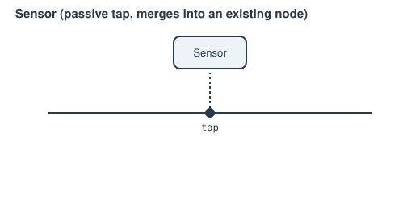

# Sensor

A passive measurement tap on a network node. Connect it to whatever node you
want to read — it merges into that existing node rather than creating a new
one.

**Ports:** `tap` &nbsp;·&nbsp; **Residuals:** none — purely a read, never a
perturbation; wiring one in anywhere never changes the solved state or adds
an unknown.

`report_metrics()` exposes `"P [Pa]"`, `"T [K]"`, `"h [J/kg]"`, and
`"mdot [kg/s]"` (omitted if this node's mdot isn't part of the solve).
[`Controller`](controller.md)/[`PIDController`](pid-controller.md) read
these the same way [`Setpoint`](setpoint.md) reads a component's own
`report_metrics()`.

---
Part of [Control & instrumentation](index.md).
