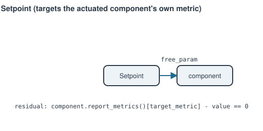

# Setpoint

Drives one of a component's own `report_metrics()` outputs to a target
value, by leaning on a free parameter that component already declared.

**Ports:** none &nbsp;·&nbsp; **Parameters:** `component`, `free_param`,
`target_metric`, `value`

$$
\text{component.report\_metrics(state)[target\_metric]} - \text{value} = 0
$$

Generalizes "give a target instead of a direct input" to any
component/metric pair — tie a compressor's free `N` to a target power, or
to a target `PR`, without a bespoke constructor argument for each case.
Raises `ValueError` at construction if the target component doesn't
currently declare `free_param` as free.

For a target read from an *independent* sensor elsewhere in the network
instead of the actuated component's own metric, see
[`Controller`](controller.md).

---
Part of [Control & instrumentation](index.md).
