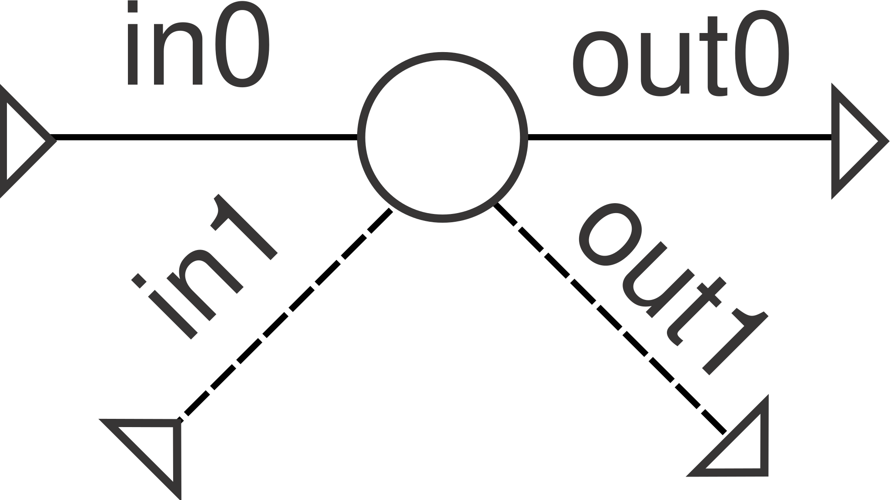

# Junction

Any number of inlets combine and split into any number of outlets — a
zero-loss, zero-volume plenum (`n_inlets=1` is a pure splitter, `n_outlets=1`
a pure merger).

**Ports:** `in0`, `in1`, ... , `out0`, `out1`, ... &nbsp;·&nbsp;
**Parameters:** `n_inlets`, `n_outlets`, `split_fractions` (default: equal
split, should sum to 1)

Every outlet shares one common pressure (the first inlet's) and the
mass-weighted mixture enthalpy of all inlets:

$$
P_\text{out,i} - P_\text{ref} = 0
\qquad
h_\text{out,i} - \frac{\sum_j \dot m_j\, h_j}{\sum_j \dot m_j} = 0
\qquad
\dot m_\text{out,i} - s_i \sum_j \dot m_j = 0
$$

where $s_i$ is `split_fractions[i]`. Junction also does real **composition
mixing**: if every inlet fluid exposes a `mass_fractions()`/`mechanism`
contract (both `CanteraFluid` and [`Combustor`](../combustion/combustor.md)'s
product fluid do), outlets get a genuine mass-weighted composition blend
instead of just the first inlet's fluid passed through — see [Composition
propagation](../index.md#composition-propagation).

---
Part of [Flow elements](index.md).
