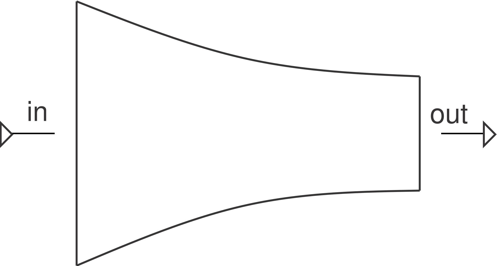

# Nozzle

A converging (or converging-diverging, with `D_exit`) nozzle: converts a
pressure/enthalpy drop into velocity — a [`Turbine`](../turbomachinery/turbine.md)
with no shaft, no mechanical power extracted.

**Ports:** `in`, `out` &nbsp;·&nbsp; **Parameters:** `D` (throat diameter),
`eta` (velocity coefficient, default 0.98), `gamma` (optional, else derived
from the fluid), `D_exit` (optional, for a diverging section)

Isentropic expansion from inlet stagnation conditions down to the outlet
static pressure:

$$
T_\text{throat,s} = T_\text{in}\left(\frac{P_\text{throat}}{P_\text{in}}\right)^{\frac{\gamma-1}{\gamma}}
\qquad
\Delta h_\text{actual} = \eta\,(h_\text{in} - h_\text{throat,s})
\qquad
V = \sqrt{2\,\Delta h_\text{actual}}
$$

**Choked flow:** if the pressure ratio falls below the critical ratio
$\left(\frac{2}{\gamma+1}\right)^{\gamma/(\gamma-1)}$, the throat is sonic
and `mdot`/`V` are capped at their critical-ratio values instead of
continuing to grow — a physical limit on the maximum mass flow a given
throat area can pass, not a numerical safeguard.

Unlike [`Pipe`](pipe.md)/[`Valve`](valve.md) (where `mdot` is given and `Δp`
is solved for), a nozzle's throat area *determines* mass flow from
continuity — `residuals()` solves for `mdot` instead:

$$
\dot m_\text{in} - \rho_\text{throat}\,A\,V_\text{throat} = 0
$$

With `D_exit > D` given (a converging-diverging nozzle), once choked the
flow continues expanding isentropically through the diverging section to
whatever supersonic Mach number the area ratio `A_exit/A_throat` implies
(the standard isentropic area-Mach relation) — reported as `Mach_exit [-]`
and the fully-expanded design exit pressure `P_exit_ideal [Pa]`. Real
off-design shock behavior isn't modeled; compare `P_exit_ideal` against the
network's actual downstream pressure to judge how far off-design the
operating point is.

---
Part of [Flow elements](index.md).
