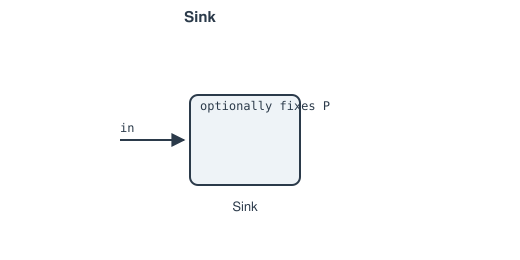

# Sink

An open boundary terminating a network branch.

**Ports:** `in`

**Fixes:** nothing, if `P=None` (the default) — a pass-through exit that
absorbs whatever mass flow is fixed elsewhere. If `P` is given, it pins the
inlet node's pressure via one residual, leaving enthalpy free:

$$P_\text{in} - P = 0$$

This is the physical closure a real open exhaust has (it expands back down
to ambient), and pairs with [`Source`](source.md)`(mdot=None)`: total mass
flow becomes a Newton unknown, solved for as whatever value is
self-consistent with every component's characteristic in between.

**See also:** for a genuinely closed loop with no open boundary at all (a
recirculating ORC/Rankine/Brayton cycle), see [`Recycle`](recycle.md)
instead — it anchors mass flow without also fixing `(P, h)`.

---
Part of [Flow elements](index.md).
