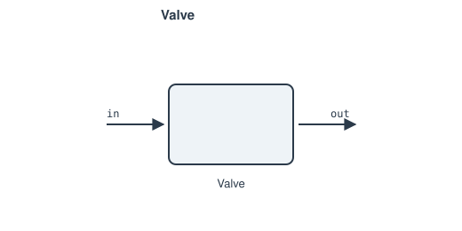

# Valve

A flow-restriction pressure drop via a loss coefficient `K`. Throttling is
isenthalpic (no work, no heat exchange).

**Ports:** `in`, `out` &nbsp;·&nbsp; **Parameters:** `D` (diameter), `K`
(loss coefficient), `opening` (0–1, default 1.0 = fully open)

$$
K_\text{eff} = \frac{K}{\text{opening}^2}
\qquad
\Delta p = K_\text{eff}\,\frac{\rho v^2}{2}
$$

$$
P_\text{in} - P_\text{out} - \Delta p = 0
\qquad
h_\text{in} - h_\text{out} = 0
$$

`opening` scales resistance up as the valve closes — connect it to a
[`Setpoint`](../control/setpoint.md)/[`PIDController`](../control/pid-controller.md)
for flow control.

---
Part of [Flow elements](index.md).
