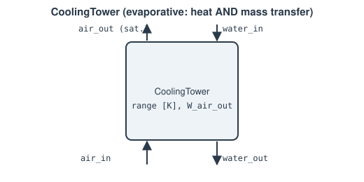

# CoolingTower

Evaporative cooling: a warm water stream is cooled by direct contact with
an air stream, which picks up water-vapor mass (and hence its own humidity
ratio `W` changes) as it does — the real, evaporative counterpart to
modeling a cooling tower as a plain dry-air [`HeatExchanger`](heat-exchanger.md)
(no humidity, no mass transfer).

**Ports:** `water_in`, `water_out`, `air_in`, `air_out` — `air_in`'s fluid
must be humid-air-capable (a `HumidAirFluid`; see `thermowave.fluids.
psychrometrics.require_humid_air()`) &nbsp;·&nbsp; **Parameters:** `range`
(K, water-side temperature drop), `PR_water`, `PR_air` (default 1.0),
`target_RH_out` (default 1.0 — fully saturated outlet air), `W_air_out_guess`
(default 0.02, the initial guess for the free unknown below)

v1 models the outlet air as **saturated** — a standard, well-established
simplified idealization for a first cut; a Merkel/NTU-based partial-
saturation effectiveness is a natural future extension (`target_RH_out` is
already the non-breaking hook a later version would use), the same maturity
path `HeatExchanger` itself took from fixed-effectiveness to UA/NTU.

**Water side** — a direct target-state spec (`Condenser`'s style, not an
effectiveness calculation):

$$
h_\text{water,out,target} = h\!\left(P_\text{water,out},\ T_\text{water,in} - \text{range}\right)
$$

**Air side** — `W_\text{air,out}` is a genuinely free Newton unknown (the
same free-parameter pattern `Combustor`'s own `mdot_fuel` uses), closed by a
saturation residual. Because `HumidAirFluid`'s own `mdot` convention is
**dry-air** mass flow (see the API reference), dry air itself is conserved
through a pure evaporative process — `air_out`'s mdot is *not* a separate
free unknown, only `W` changes:

$$
W_\text{target} = W(T_\text{air,out},\ \text{target\_RH\_out})
\qquad
W_\text{air,out} - W_\text{target} = 0
$$

**Mass conservation** ties the two streams together — what the water side
loses is exactly what the air side's humidity gains:

$$
\dot m_\text{evap} = \dot m_\text{dry\,air}\left(W_\text{air,out} - W_\text{air,in}\right)
\qquad
\dot m_\text{water,out} = \dot m_\text{water,in} - \dot m_\text{evap}
$$

**Overall energy balance** closes the system (not a two-step "compute duty,
then push it across" the way `Condenser`/`FeedwaterHeater` work — there's no
single well-defined "Q" once evaporated mass carries its own enthalpy across
the boundary with it; `HumidAirFluid`'s own enthalpy is already, by
construction, on a dry-air basis and correctly includes whatever
water-vapor content each state carries):

$$
\dot m_\text{water,in}\,h_\text{water,in} + \dot m_\text{dry\,air}\,h_\text{air,in}
\;-\;
\dot m_\text{water,out}\,h_\text{water,out,target} - \dot m_\text{dry\,air}\,h_\text{air,out} = 0
$$

7 residuals in total: water momentum/energy/mass, air momentum/energy/mass,
and the saturation residual above.

`report_metrics()` exposes `range [K]` (achieved), `T_water_in`/
`T_water_out`/`T_air_out [K]`, `W_air_in`/`W_air_out [-]`, `RH_air_out [-]`,
and `mdot_evap [kg/s]`.

---
Part of [Heat exchangers & phase change](index.md).
