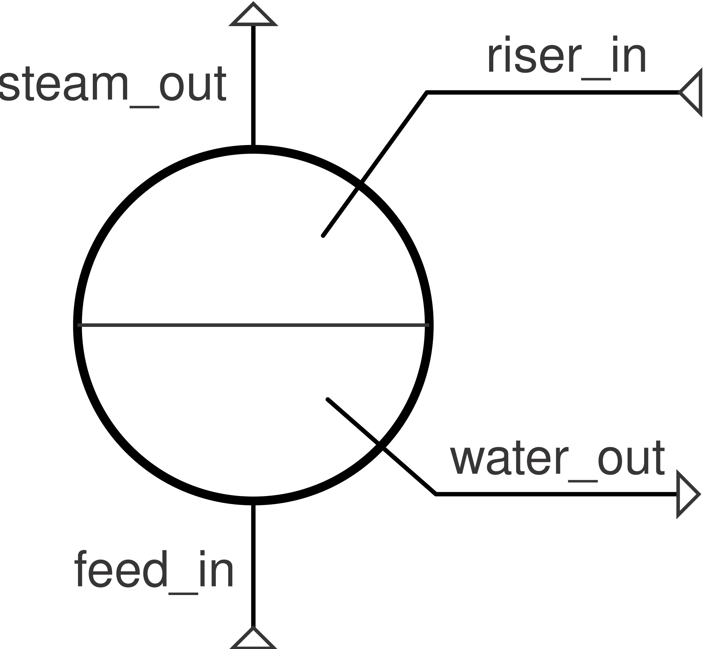

# Drum

A steam drum: a constant-volume, two-phase reservoir at saturation, with
genuine liquid-level dynamics — a boiler's steam/water separator.

**Ports:** `feed_in`, `steam_out`, `water_out` (plus `riser_in` if
`has_riser=True`, the default) &nbsp;·&nbsp; **Parameters:** `V`, `P0`,
`fluid`, `level0` (default 0.5), `has_riser`, `heat_loss` (optional)

**Differential state:** `(P, h)`, driven by mass and energy conservation on
the drum's contents (mass `m = ρ(P,h)·V`; the same finite-difference
2×2 linear solve as [`Tank`](tank.md), generalized to multiple inlets):

$$
\frac{dm}{dt} = \sum \dot m_\text{in} - \sum \dot m_\text{out}
\qquad
\frac{d(mu)}{dt} = \sum \dot m_\text{in} h_\text{in} - \sum \dot m_\text{out} h_\text{out} - \dot Q_\text{loss}
$$

Each outlet leaves at its own saturation enthalpy — `steam_out` at $h_g(P)$,
`water_out` at $h_f(P)$:

$$
P_\text{steam} - P_\text{drum} = 0 \qquad h_\text{steam} - h_g(P_\text{drum}) = 0
$$

$$
P_\text{water} - P_\text{drum} = 0 \qquad h_\text{water} - h_f(P_\text{drum}) = 0
$$

All mdots are left free, closed by whatever the drum connects to. A drum's
liquid level has **no steady-state restoring force** — it's a pure
integrator, exactly like a real drum needs level control. `Network.solve()`
is therefore singular in the drum's own `h`; use `Network.solve_transient()`
instead.

---
Part of [Heat exchangers & phase change](index.md).
