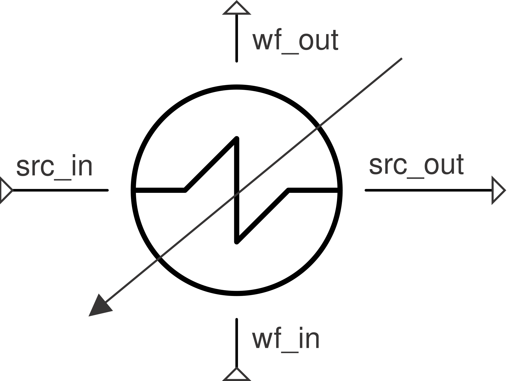

# Evaporator

Two-stream phase-change equipment: a boiling working fluid (`wf`) coupled
to an explicit single-phase heat-source stream. Duty comes from the `wf`
outlet spec, **never** an effectiveness/UA calculation (`cp` is effectively
infinite during phase change).

**Ports:** `wf_in`, `wf_out`, `src_in`, `src_out` &nbsp;·&nbsp;
**Parameters:** `PR_wf`, `PR_src`, `outlet_quality` (default 1.0 =
saturated vapor), `superheat` (K above saturation, if > 0)

$$
h_\text{wf,out,target} = \begin{cases}
h(P_\text{wf,out}, q=\text{outlet\_quality}) & \text{superheat} = 0 \\
h\!\left(P_\text{wf,out},\, T_\text{sat}(P_\text{wf,out}) + \text{superheat}\right) & \text{superheat} > 0
\end{cases}
$$

$$
Q = \dot m_\text{wf}\cdot\left(h_\text{wf,out,target} - h_\text{wf,in}\right)
\qquad
h_\text{src,out} = h_\text{src,in} - \frac{Q}{\dot m_\text{src}}
$$

**Pinch is a diagnostic, not a solved constraint**: `report_metrics()`
exposes `pinch [K]` `= T_src_out - T_sat(P_wf_out)`. A negative pinch means
the source would have to end up colder than the boiling fluid — a
thermodynamically infeasible spec, not a solver bug.

For the same physics without modeling the heat-source stream explicitly,
see [`SimpleEvaporator`](simple-evaporator.md); for the condensing
counterpart, see [`Condenser`](condenser.md).

---
Part of [Heat exchangers & phase change](index.md).
