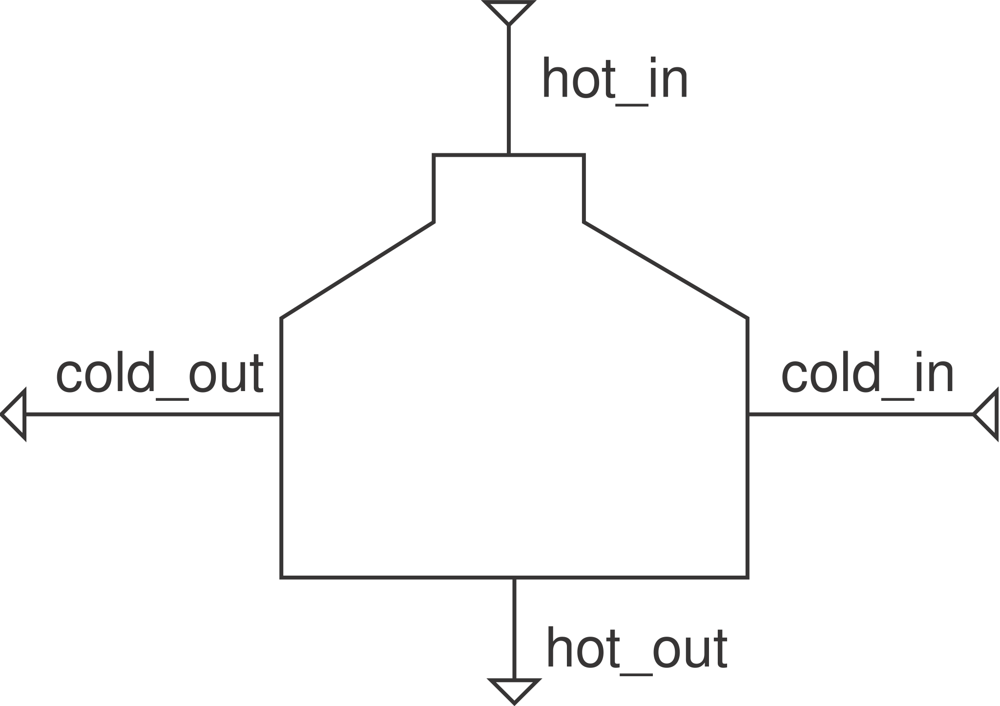
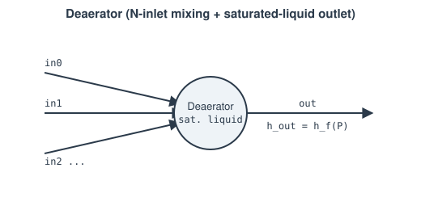

# Feedwater heaters

Two components covering both regenerative feedwater-heater topologies: a
closed shell-and-tube unit ([`FeedwaterHeater`](#feedwaterheater-closed))
whose two streams never mix, and an open, direct-contact unit
([`Deaerator`](#deaerator-open)) that mixes several streams into one. Both
require a two-phase-capable fluid (`CoolPropFluid`, the `coolprop` extra) —
checked at residual time.

## `FeedwaterHeater` (closed)

Condensing extraction steam (`hot`) heats a single-phase feedwater stream
(`cold`) that never mixes with it — structurally [`Condenser`](condenser.md)
renamed and generalized (a closed FWH genuinely *is* a condenser whose
"coolant" happens to be feedwater instead of ambient cooling water; nothing
in the physics distinguishes the two cases).

**Ports:** `hot_in`, `hot_out`, `cold_in`, `cold_out` &nbsp;·&nbsp;
**Parameters:** `PR_hot`, `PR_cold`, `outlet_quality` (default 0.0 =
saturated liquid drain), `subcool` (K below saturation, if > 0)

$$
h_\text{hot,out,target} = \begin{cases}
h(P_\text{hot,out}, q=\text{outlet\_quality}) & \text{subcool} = 0 \\
h\!\left(P_\text{hot,out},\, T_\text{sat}(P_\text{hot,out}) - \text{subcool}\right) & \text{subcool} > 0
\end{cases}
$$

$$
Q = \dot m_\text{hot}\cdot\left(h_\text{hot,in} - h_\text{hot,out,target}\right)
\qquad
h_\text{cold,out} = h_\text{cold,in} + \frac{Q}{\dot m_\text{cold}}
$$

`report_metrics()` exposes `pinch [K]` — feedwater-heater terminology calls
this the **TTD** (terminal temperature difference), `= T_sat(P_hot_out) -
T_cold_out` — as a diagnostic, not a solved constraint, same as `Condenser`'s
own pinch.

**Why not just use a hand-built `SimpleCondenser` + `SimpleEvaporator` +
`Junction`?** That was the pattern before this component existed, and it
still works — but the two sides' duties are independently fixed (the cold
side's duty has to be precomputed from a design assumption, outside the
solve) rather than genuinely tied together, so the two sides' energy
balances only approximately agree. `FeedwaterHeater` computes `Q` **once**,
shared by both sides — no gap by construction.

## `Deaerator` (open)

`N` inlet streams (direct steam extraction, a condensate drain cascade, ...)
mix at one common pressure and leave as a single saturated-liquid stream —
[`Junction`](../flow-elements/junction.md)'s own mass-weighted mixing, plus
the one constraint `Junction` alone doesn't provide: a genuine phase-
equilibrium pin on the outlet, the same pattern [`Drum`](drum.md) already
uses for its own `steam_out`/`water_out`, minus `Drum`'s differential-storage
machinery (this is a purely algebraic mixing+equilibrium point, not a
dynamic vessel).

**Ports:** `in0`, `in1`, ..., `out` &nbsp;·&nbsp; **Parameters:** `n_inlets`
(≥ 2)

Common outlet pressure is taken from the first inlet (same simplification
`Junction`'s own docstring documents):

$$
P_\text{out} - P_\text{ref} = 0
\qquad
h_\text{out} - h_f(P_\text{out}) = 0
\qquad
\dot m_\text{out} - \sum_i \dot m_i = 0
$$

A plain `Junction` standing in for a deaerator works only if the upstream
extraction split happens to be sized so the mixed enthalpy lands near
saturation — nothing checks or corrects it. `Deaerator` solves for it
directly instead.

---
Part of [Heat exchangers & phase change](index.md).
