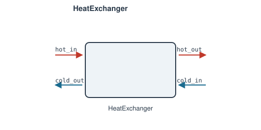

# HeatExchanger

Two variants: [`HeatExchanger`](#heatexchanger-two-stream) is a two-stream
exchanger (hot side transferring heat to a cold side), and
[`SimpleHeatExchanger`](#simpleheatexchanger-single-stream) is a
single-stream, `Q`-driven heater/cooler for when there's no second stream
to model at all.

## `HeatExchanger` (two-stream)

Fixed effectiveness, or effectiveness derived from geometry (`UA`, flow
arrangement) — auto-selected by which one you give. Give exactly one of
`effectiveness` or `UA`; passing both, or neither, raises `ValueError`.

**Ports:** `hot_in`, `hot_out`, `cold_in`, `cold_out` &nbsp;·&nbsp;
**Parameters:** `PR_hot`, `PR_cold`, plus one of:
- `effectiveness` — fixed-effectiveness mode
- `UA`, `n_passes` (default 1), `arrangement` (`"counterflow"` /
  `"parallel"` / `"crossflow"` / `"shell_and_tube"` / `"custom"`),
  `correlation` (required iff `arrangement="custom"`) — UA/NTU mode

### Fixed-effectiveness mode (`effectiveness=...`)

A datasheet or an existing exchanger's known performance rating:

$$
C_\text{hot} = \dot m_\text{hot}\,c_{p,\text{hot}}
\qquad
C_\text{cold} = \dot m_\text{cold}\,c_{p,\text{cold}}
\qquad
C_\text{min} = \min(C_\text{hot}, C_\text{cold})
$$

$$
Q = \varepsilon \cdot C_\text{min} \cdot (T_\text{hot,in} - T_\text{cold,in})
$$

$$
P_\text{hot,out} - PR_\text{hot}\,P_\text{hot,in} = 0
\qquad
h_\text{hot,out} - \left(h_\text{hot,in} - \frac{Q}{\dot m_\text{hot}}\right) = 0
$$

(and the mirror pair on the cold side, with `+Q/mdot_cold`). `Q` is not
clamped to `≥ 0` — a network wired with the "hot" side actually colder than
the "cold" side just yields negative `Q` (heat flowing the other way).

### UA/NTU mode (`UA=...`)

Effectiveness comes from the standard effectiveness-NTU relations instead
of being a direct input:

$$
C_r = \frac{C_\text{min}}{C_\text{max}} \qquad NTU = \frac{UA}{C_\text{min}}
$$

$$
\varepsilon_\text{counterflow} = \frac{1-e^{-NTU(1-C_r)}}{1-C_r\,e^{-NTU(1-C_r)}}
\qquad
\varepsilon_\text{parallel} = \frac{1-e^{-NTU(1+C_r)}}{1+C_r}
$$

$$
\varepsilon_\text{crossflow} = 1 - \exp\left[\frac{NTU^{0.22}}{C_r}\left(e^{-C_r\,NTU^{0.78}}-1\right)\right]
$$

`n_passes > 1` chains that many stages in series for these three
arrangements — mathematically a no-op for counterflow/parallel (subdividing
an exact closed-form solution doesn't change it) and not guaranteed to help
for crossflow (an approximation on top of an approximation).

`"shell_and_tube"` is the genuine reversing-header case: `n_passes` is the
number of *shell* passes `N` (each internally 2 tube passes, standard TEMA
"1-2N"), combined via the Bowman/Mueller/Nagle F-correction relation:

$$
\varepsilon_1 = \frac{2}{1+C_r+\sqrt{1+C_r^2}\cdot\dfrac{1+e^{-NTU_1\sqrt{1+C_r^2}}}{1-e^{-NTU_1\sqrt{1+C_r^2}}}}
\qquad NTU_1 = \frac{NTU}{N}
$$

combined in series across `N` shells (see the source docstring for the
full combination formula) — unlike the other three arrangements, `n_passes`
here is a real physical lever: effectiveness strictly increases with `N`,
converging toward the true counterflow limit.

`"custom"` plugs in your own `correlation(NTU, Cr) -> effectiveness`
callable for a plate-fin/finned-tube/vendor correlation.

Both single-fluid and dual-fluid streams share the network's single fluid
model (no distinct hot/cold fluid types yet — same limitation as every
other component here). Both side's pressure drop is a simple fixed ratio
(not a K-factor loss model); in UA/staged mode it's split evenly in log
space across passes.

### `MultiPassHeatExchanger`

A thin, always-UA/NTU-mode subclass of `HeatExchanger` — its constructor
(`MultiPassHeatExchanger(name, UA, PR_hot, PR_cold, n_passes=1,
arrangement=..., correlation=None)`) just forwards to
`HeatExchanger.__init__(..., UA=UA, ...)`, so no math is duplicated between
the two classes; everything above (effectiveness-NTU relations,
`n_passes`, `arrangement`, `shell_and_tube`'s F-correction, `custom`
correlations) applies unchanged.

**Ports:** `hot_in`, `hot_out`, `cold_in`, `cold_out` &nbsp;·&nbsp;
**Parameters:** `UA`, `PR_hot`, `PR_cold`, `n_passes` (default 1),
`arrangement`, `correlation` (required iff `arrangement="custom"`)

`HeatExchanger(UA=...)` is equivalent — use `MultiPassHeatExchanger`
directly when you want "this exchanger's rating comes from geometry, not a
given effectiveness" explicit at the call site (or an `isinstance()`
check).

## `SimpleHeatExchanger` (single-stream)

Single-stream heat addition/removal, 0D model: one fluid network, one duty
`Q` — not a two-stream exchanger like the ones above. It's the "apply `Q`
to this stream" building block, e.g. a heater/cooler/duty specified
directly rather than derived from a second stream's own state.

**Ports:** `in`, `out` &nbsp;·&nbsp;
**Parameters:** `Q`, `PR`

$$
P_\text{out} - PR\,P_\text{in} = 0
\qquad
h_\text{out} - \left(h_\text{in} + \frac{Q}{\dot m}\right) = 0
$$

`Q` [W]: positive heats the fluid, negative cools it — give it directly, or
leave it `None` to make it a free Newton unknown, closed by a
`Setpoint`/`Controller`/`PIDController` targeting some downstream quantity
(the same free-parameter pattern as `Combustor`'s `mdot_fuel`). Not clamped
either way; a `Q` that drives the outlet temperature outside the fluid
model's valid range fails the same way any other component's residuals
would.

Pressure drop is a simple fixed ratio (`P_out = PR * P_in`, same style as
`SimpleCompressor`/`SimpleTurbine`), not a K-factor loss model.

---
Part of [Heat exchangers & phase change](index.md).
