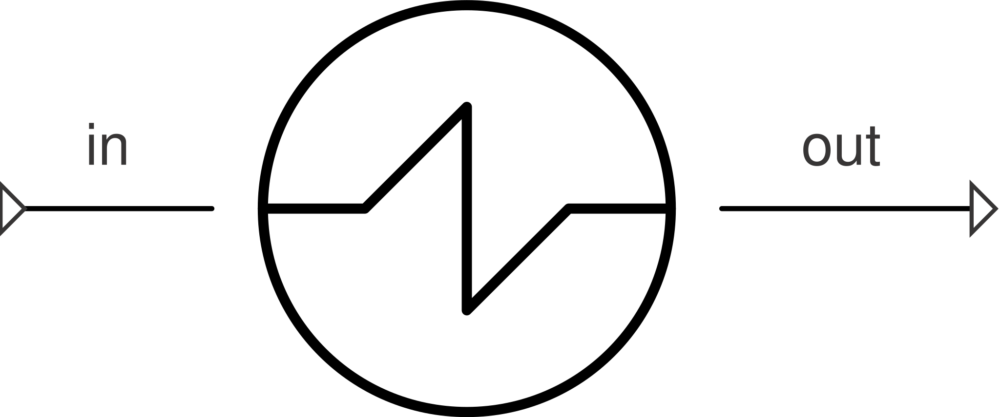

# SimpleHeater

Single-stream heater targeting a fixed outlet **temperature**, without
modeling the second stream that supplies the heat — the single-phase-safe
counterpart to [`SimpleEvaporator`](evaporator.md)'s outlet-spec mode.

**Ports:** `in`, `out` &nbsp;·&nbsp; **Parameters:** `T_out` (K, required),
`PR` (default 1.0)

$$
h_\text{out,target} = h(P_\text{out},\, T_\text{out})
\qquad
Q = \dot m\cdot\left(h_\text{out,target} - h_\text{in}\right)
$$

`Q` is a *reported* result, not a residual — same convention as
`SimpleEvaporator`/`SimpleCondenser`. `P_out = PR * P_in`.

**Why not `SimpleEvaporator`?** `SimpleEvaporator`/`SimpleCondenser` target a
state *relative to the saturation curve* (superheat/subcool/quality), which
only makes sense below the fluid's critical pressure. `SimpleHeater` targets
an outlet temperature directly instead, so it works identically whether the
fluid ends up sub- or supercritical — the component to reach for when
heating a stream that stays supercritical throughout (e.g. an sCO2 cycle's
external heater/receiver, well above CO2's ~73.8 bar critical pressure).
Unlike the rest of this page's components, it does **not** require a
two-phase-capable fluid model.

Prefer `SimpleEvaporator` instead whenever a superheat/subcool/quality
target is the natural way to describe the outlet — `SimpleHeater` is the
fallback for when that framing doesn't apply, not a general replacement
for it.

---
Part of [Heat exchangers & phase change](index.md).
