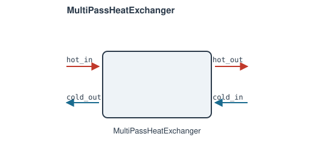

# MultiPassHeatExchanger

The geometry-based counterpart to
[`SimpleHeatExchanger`](simple-heat-exchanger.md): effectiveness comes from
the standard effectiveness-NTU relations given `UA` and a flow arrangement,
instead of being a direct input.

**Ports:** `hot_in`, `hot_out`, `cold_in`, `cold_out` &nbsp;·&nbsp;
**Parameters:** `UA`, `PR_hot`, `PR_cold`, `n_passes` (default 1),
`arrangement` (`"counterflow"` / `"parallel"` / `"crossflow"` /
`"shell_and_tube"` / `"custom"`), `correlation` (required iff
`arrangement="custom"`)

$$
C_r = \frac{C_\text{min}}{C_\text{max}} \qquad NTU = \frac{UA}{C_\text{min}}
$$

$$
\varepsilon_\text{counterflow} = \frac{1-e^{-NTU(1-C_r)}}{1-C_r\,e^{-NTU(1-C_r)}}
\qquad
\varepsilon_\text{parallel} = \frac{1-e^{-NTU(1+C_r)}}{1+C_r}
$$

$$
\varepsilon_\text{crossflow} = 1 - \exp\left[\frac{NTU^{0.22}}{C_r}\left(e^{-C_r\,NTU^{0.78}}-1\right)\right]
$$

`n_passes > 1` chains that many stages in series for these three
arrangements — mathematically a no-op for counterflow/parallel (subdividing
an exact closed-form solution doesn't change it) and not guaranteed to help
for crossflow (an approximation on top of an approximation).

`"shell_and_tube"` is the genuine reversing-header case: `n_passes` is the
number of *shell* passes `N` (each internally 2 tube passes, standard TEMA
"1-2N"), combined via the Bowman/Mueller/Nagle F-correction relation:

$$
\varepsilon_1 = \frac{2}{1+C_r+\sqrt{1+C_r^2}\cdot\dfrac{1+e^{-NTU_1\sqrt{1+C_r^2}}}{1-e^{-NTU_1\sqrt{1+C_r^2}}}}
\qquad NTU_1 = \frac{NTU}{N}
$$

combined in series across `N` shells (see the source docstring for the
full combination formula) — unlike the other three arrangements, `n_passes`
here is a real physical lever: effectiveness strictly increases with `N`,
converging toward the true counterflow limit.

`"custom"` plugs in your own `correlation(NTU, Cr) -> effectiveness`
callable for a plate-fin/finned-tube/vendor correlation.

---
Part of [Heat exchangers & phase change](index.md).
