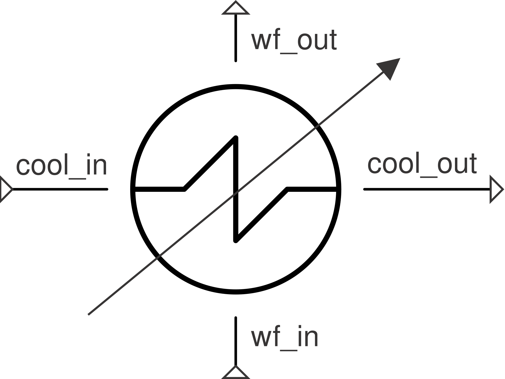

# SimpleCondenser

Single-stream condenser: rejects heat to hit a specified outlet condition
without modeling the coolant stream explicitly (the phase-change analogue
of [`SimpleCombustor`](../combustion/simple-combustor.md)).

**Ports:** `in`, `out` &nbsp;·&nbsp; **Parameters:** `PR` (default 1.0),
`outlet_quality` (default 0.0 = saturated liquid), `subcool` (K below
saturation), `duty` (optional — fix heat directly instead of an outlet
spec)

- **Outlet-spec mode** (default, `duty=None`): outlet pinned to
  `outlet_quality`/`subcool` (same targets as [`Condenser`](condenser.md));
  `Q = mdot * (h_out - h_in)` (negative) is a *reported* result.
- **Duty mode** (`duty` given, `[W]`, negative for heat rejection):
  `h_out = h_in + duty/mdot`; the resulting outlet quality/subcool is
  reported instead.

For the same physics coupled to an explicit coolant stream, see
[`Condenser`](condenser.md).

---
Part of [Heat exchangers & phase change](index.md).
