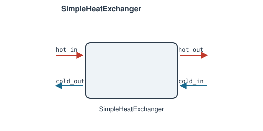

# SimpleHeatExchanger

Single-stream heat addition/removal, 0D model: one fluid network, one duty
`Q` — not a two-stream exchanger (see [`HeatExchanger`](heat-exchanger.md)
for that). It's the "apply `Q` to this stream" building block, e.g. a
heater/cooler/duty specified directly rather than derived from a second
stream's own state.

**Ports:** `in`, `out` &nbsp;·&nbsp;
**Parameters:** `Q`, `PR`

$$
P_\text{out} - PR\,P_\text{in} = 0
\qquad
h_\text{out} - \left(h_\text{in} + \frac{Q}{\dot m}\right) = 0
$$

`Q` [W]: positive heats the fluid, negative cools it — give it directly, or
leave it `None` to make it a free Newton unknown, closed by a
`Setpoint`/`Controller`/`PIDController` targeting some downstream quantity
(the same free-parameter pattern as `Combustor`'s `mdot_fuel`). Not clamped
either way; a `Q` that drives the outlet temperature outside the fluid
model's valid range fails the same way any other component's residuals
would.

Pressure drop is a simple fixed ratio (`P_out = PR * P_in`, same style as
`SimpleCompressor`/`SimpleTurbine`), not a K-factor loss model.

For a two-stream exchanger (hot side transferring heat to a cold side, no
`Q` given directly), see [`HeatExchanger`](heat-exchanger.md).

---
Part of [Heat exchangers & phase change](index.md).
