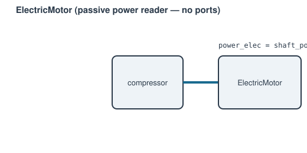

# ElectricMotor



Electrically-driven mechanical power source — the inverse of
[`SimpleGenerator`](generator.md#simplegenerator-fixed-efficiency). A passive reader with no flow
ports: it reads a mechanical component's own required shaft power through a
`"power"` signal port (e.g. an electrically-driven compressor with no
turbine on its shaft) and reports the electrical power that must be drawn
to supply it.

**Ports:** none (flow) — mechanical: `shaft` &nbsp;·&nbsp; signal: `power`
&nbsp;·&nbsp; **Parameters:** `efficiency`

```python
motor = ElectricMotor(name="m1", efficiency=0.92)
network.add_component(motor)
network.connect(motor, "power", compressor, "power", kind="signal")
network.connect(motor, "shaft", compressor, "shaft", kind="mechanical")  # optional, for N in report_metrics()
```

$$
P_\text{elec} = \frac{P_\text{shaft, required}}{\eta}
$$

**Residuals:** none — purely a derived reading. The mechanical component's
own free speed, if it has one, still needs its own
[`Setpoint`](../control/setpoint.md)/[`Controller`](../control/controller.md)
targeting its `"shaft"` port.

---
Part of [Mechanical & electrical](index.md).
