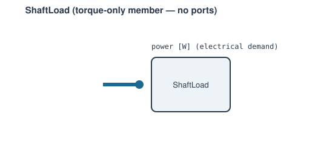

# ShaftLoad



A constant-power mechanical load on a [`Shaft`](shaft.md) — the electrical
demand a generator (plus power electronics) actually places on the rotor.
Unlike [`SimpleGenerator`](generator.md#simplegenerator-fixed-efficiency)/[`Generator`](generator.md#generator-torque-map)
(passive readers that only *report* power), `ShaftLoad` is a genuine torque
on the shaft: its demanded power enters the shaft power balance directly,
so the equilibrium speed becomes wherever turbine power covers compressor
power *plus* this demand.

**Ports:** none (flow or mechanical — no speed unknown of its own) —
signal: `power` &nbsp;·&nbsp; **Parameters:** `power` (electrical demand,
`[W]`), `efficiency` (default 1.0)

```python
load = ShaftLoad(name="load", power=5_000.0, efficiency=0.94)
network.add_component(load)
network.connect(shaft, "p2", load, "power", kind="signal")
```

**Residuals:** none — it contributes no speed unknown (no `"shaft"`
mechanical port, so `Shaft` never mechanically connects to it), only a
power term `power / efficiency` published on its `"power"` signal port for
whichever `Shaft` reads it (with sign `-1.0` for a draw). `power` is a
plain mutable attribute, so a [`Schedule`](../control/schedule.md) can
drive it through a dispatch profile during `solve_transient()`.

---
Part of [Mechanical & electrical](index.md).
