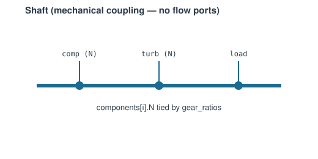

# Shaft

A mechanical connection: two or more components sharing one physical shaft.
No flow ports — a mechanical, not flow, coupling.

**Ports:** none &nbsp;·&nbsp; **Parameters:** `components`, `gear_ratios`,
`signs`, `efficiency`, `inertia`, `dynamic` (bool), `N0`

Two modes:

- **`dynamic=False`** (default, steady-state coupling): every connected
  component's own free speed parameter is tied to the first component's:

  $$N_i - \text{gear\_ratio}_i \cdot N_0 = 0 \quad \text{for each follower } i$$

  `components[0]`'s own speed is still a free unknown needing an external
  [`Setpoint`](../control/setpoint.md)/[`Controller`](../control/controller.md).

- **`dynamic=True`**: the shaft owns its own rotor speed as **differential
  state**, integrated from net torque and inertia:

  $$\frac{dN}{dt} = \frac{P_\text{net}/\omega}{\text{inertia}}
  \qquad \omega = \frac{2\pi N}{60}$$

  and every connected component (including `components[0]`) is tied to that
  shared speed: $N_i - \text{gear\_ratio}_i \cdot N_\text{shaft} = 0$.
  `Network.solve()` closes `N_shaft` via `d N/dt = 0` (the torque-balance
  speed); `Network.solve_transient()` integrates it forward.

A component listed in `components` that does **not** declare its speed as
free (e.g. [`ShaftLoad`](shaft-load.md)) is a torque-only member: no
speed-tie residual, but its `report_metrics()["power [W]"]` still enters
the net-power sum with its `signs` entry — this is how an electrical load
enters the physics. `efficiency` (mechanical transmission efficiency)
scales the *net* reported shaft power — put it on a `dynamic=True` shaft's
load (`ShaftLoad`) instead, since a dynamic shaft's steady equilibrium is
exactly net power `== 0`, and the factor would silently cancel.

---
Part of [Mechanical & electrical](index.md).
