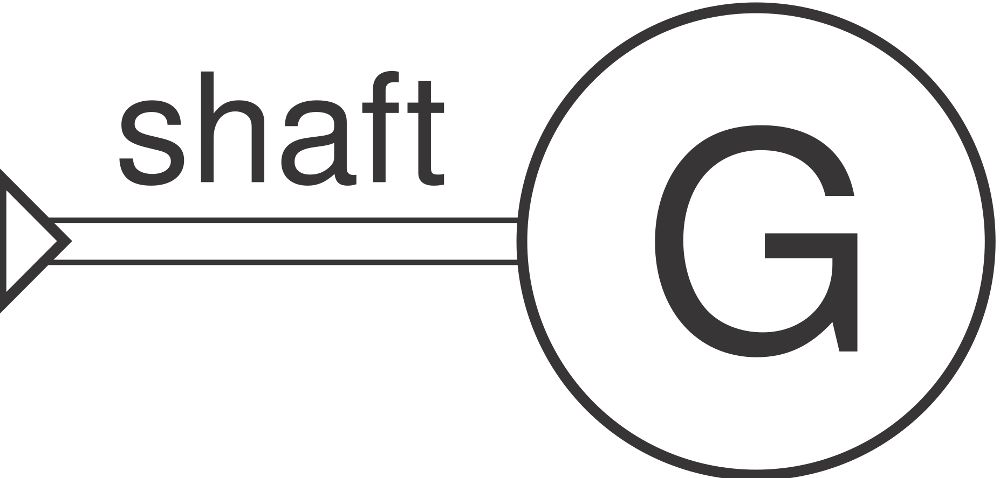

# SimpleGenerator



A passive reader of shaft power, with no flow ports and no residuals — it
reports a derived electrical output, it doesn't feed back into the solve.
Reads power through a `"power"` signal port instead of holding a direct
object reference.

**Ports:** none (flow) — mechanical: `shaft` &nbsp;·&nbsp; signal: `power`
&nbsp;·&nbsp; **Parameters:** `efficiency`

```python
gen = SimpleGenerator(name="gen1", efficiency=0.96)
network.add_component(gen)
network.connect(gen, "power", turbine, "power", kind="signal")
network.connect(gen, "shaft", turbine, "shaft", kind="mechanical")  # optional, for N in report_metrics()
```

$$P_\text{elec} = P_\text{shaft} \cdot \eta$$

For torque read off a speed-vs-torque characteristic map instead of a fixed
efficiency, see [`Generator`](generator.md). Neither couples back into the
shaft's own power balance — for a generator that genuinely loads the shaft,
use [`ShaftLoad`](shaft-load.md) instead.

---
Part of [Mechanical & electrical](index.md).
