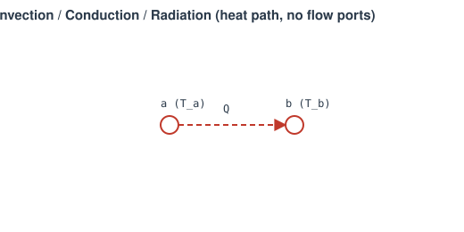

# Radiation

A passive heat path between two `TemperatureSource` endpoints (`a`, `b`) —
no flow ports, no algebraic residuals of its own. Same zero-port,
zero-residual, `a → b` sign convention as [`Convection`](convection.md).

**Ports:** none &nbsp;·&nbsp; **Parameters:** `a`, `b`, `emissivity`, `A`
(area), `view_factor` (default 1.0)

$$Q = \varepsilon \cdot F \cdot \sigma \cdot A \cdot (T_a^4 - T_b^4)$$

General-purpose surface-to-surface (or surface-to-ambient) radiative
exchange — not combustor-specific, the intended primitive a future 1D
combustion-chamber liner model would discretize into many of, rather than
needing its own formula.

---
Part of [Thermal network](index.md).
