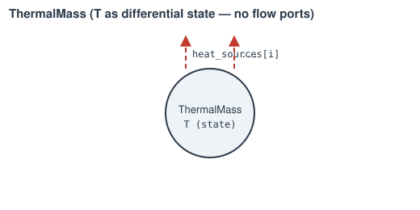

# ThermalMass

A solid's own temperature as time-integrated state (a casing, a shaft
segment, ...) — the node any [`Convection`](convection.md)/[`Conduction`](conduction.md)/
[`Radiation`](radiation.md) path attaches to on the solid side.

**Ports:** none &nbsp;·&nbsp; **Parameters:** `thermal_capacitance` (lumped
`m·cp` `[J/K]`, given directly), `T0`

**Differential state:** `T`, driven by the signed sum of every heat path
listed in `heat_sources` (populated by `Network.add_heat_path()`, which
derives the correct sign automatically from which endpoint this mass is):

$$
\frac{dT}{dt} = \frac{\sum_i \text{sign}_i \cdot Q_i(\text{state})}{\text{thermal\_capacitance}}
$$

`Network.solve()` closes `T` to whatever value makes that sum zero (steady
state); `Network.solve_transient()` integrates it forward from `T0`.

---
Part of [Thermal network](index.md).
