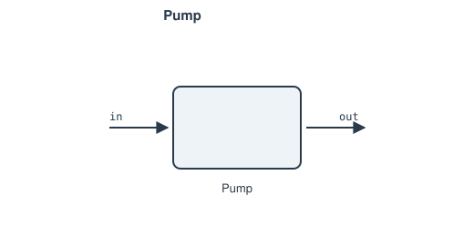

# Pump

Liquid pump: raises pressure with a small enthalpy rise via an
entropy-based isentropic path scaled by efficiency — the liquid counterpart
to a compressor, closing a Rankine loop's low-pressure side back up to
boiler pressure. Requires `entropy_ph`/`enthalpy_ps` (`CoolPropFluid`).

**Ports:** `in`, `out` &nbsp;·&nbsp; **Parameters:** exactly one of `P_out`
or `PR` (> 1), `eta` (default 0.75)

$$
s_\text{in} = s(P_\text{in}, h_\text{in})
\qquad
h_\text{out,s} = h(P_\text{out}, s_\text{in})
\qquad
\Delta h_\text{actual} = \frac{h_\text{out,s} - h_\text{in}}{\eta}
$$

Inefficiency means *more* work goes in than the ideal reversible pump —
the reverse sense from a turbine's efficiency.

---
Part of [Turbomachinery](index.md).
