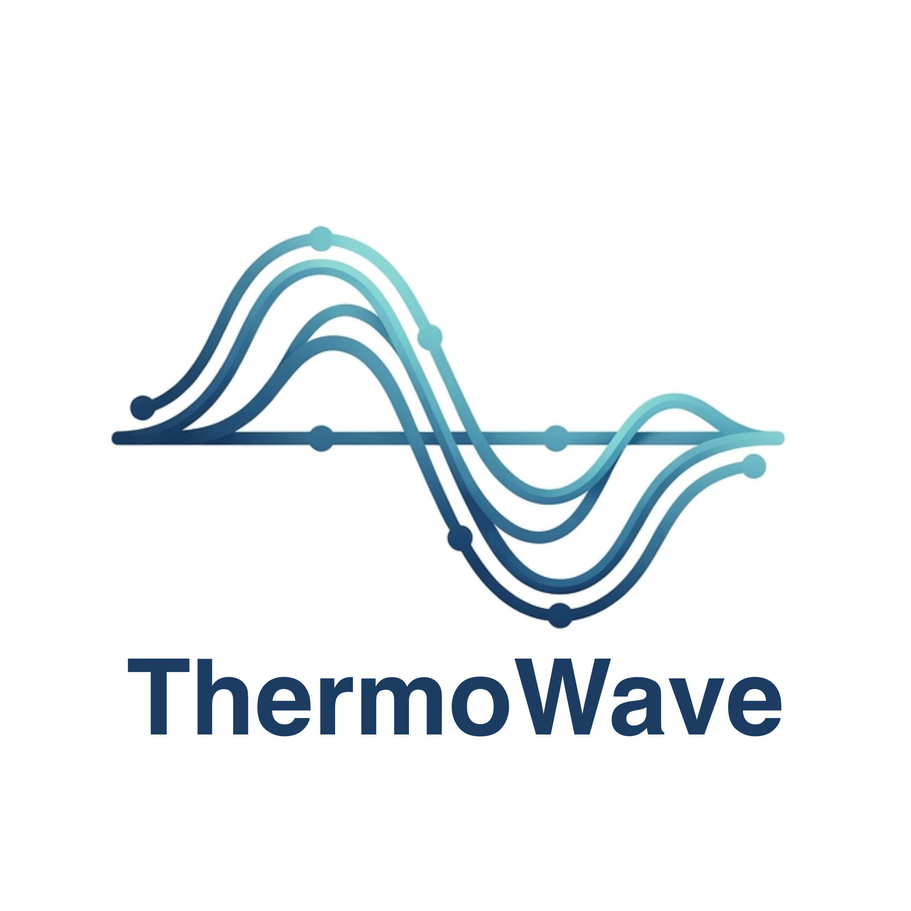

# ThermoWave

**ThermoWave** is a headless, 1D implicit thermodynamic network solver for
steady-state and transient thermal-fluid systems. You build a network out of
components — sources, pipes, valves, compressors, turbines, heat exchangers,
combustors, shafts, sensors, controllers, and more — wire their ports
together, and call `solve()`. Internally, every component contributes
unknowns and residual equations to one square Newton system, solved by
damped Newton-Raphson with a finite-difference Jacobian.

```python
from thermowave.fluids.ideal_gas import IdealGasFluid
from thermowave.core.network import Network
from thermowave.components import Source, Pipe, Sink

air = IdealGasFluid(name="air", R=287.05, cp=1005.0)
net = Network(fluid=air)

src = Source(name="src", P=200_000.0, T=300.0, mdot=1.0)
pipe = Pipe(name="pipe", L=10.0, D=0.1, roughness=4.5e-5, mu=1.8e-5)
sink = Sink(name="sink")

for c in (src, pipe, sink):
    net.add_component(c)
net.connect(src, "out", pipe, "in")
net.connect(pipe, "out", sink, "in")

result = net.solve()
result.print_report()
```

## Where to start

| | |
|---|---|
| **[Tutorials](tutorials/index.md)** | Step-by-step guides that build a complete model from scratch — start here if you're building your first network. |
| **[Examples](examples/index.md)** | Short, runnable snippets for common patterns — a single flow branch, a recuperated cycle, a PID control loop. |
| **[Components](components/index.md)** | Every component's ports, governing equations, and free parameters, with a labeled diagram for each. |
| **[Benchmarks](benchmark/index.md)** | Full network models checked against real published plant/rig data, not synthetic test cases. |
| **[API reference](api.md)** | Auto-generated reference for every public class and function. |
| **[Changelog](changelog.md)** | What changed release to release, including migration notes for breaking changes. |
| **[Contributing](contributing.md)** | Dev environment setup, the checks CI runs, and what a good PR looks like. |

## Why ThermoWave

- **Equation-oriented, not sequential.** Every component contributes
  residual equations to one shared Newton system, rather than being solved
  component-by-component in a fixed sequence. This is what lets a target be
  given anywhere in the network (a turbine outlet temperature, say) and
  drive an unknown anywhere else (a fuel flow, a shaft speed) — the solver
  finds the self-consistent operating point, not just the answer to a fixed
  forward calculation.
- **Steady and transient share one model.** A component that owns
  time-varying state (a shaft's rotor speed, a tank's pressure, a PID
  controller's output) declares it once; `Network.solve()` finds the
  equilibrium where nothing is changing, and `Network.solve_transient()`
  integrates the same equations forward in time.
- **Composable fluid models.** Constant-property ideal gas, ideal-gas
  mixtures, real-fluid properties via [CoolProp](http://www.coolprop.org/),
  equilibrium combustion chemistry via [Cantera](https://cantera.org/), and
  psychrometric humid air (also via CoolProp) all implement the same
  `BaseFluid` interface, so a component written against it works with any
  of them.
- **No hidden solve order.** Wiring mistakes (a free parameter nothing
  closes, two components fighting over the same unknown) are caught by
  `Network.check_wiring()` and a non-square-system error naming the actual
  mismatch, not a cryptic linear-algebra failure three layers down.

## Installation

```bash
pip install thermowave
pip install "thermowave[coolprop]"   # real-fluid properties via CoolProp
pip install "thermowave[cantera]"    # equilibrium-chemistry Combustor + CanteraFluid
pip install "thermowave[plot]"       # ThermoPlot (matplotlib-based charting)
pip install "thermowave[full]"       # everything, including dev/test tooling
```

Source and issue tracker: [github.com/karimialii/ThermoWave](https://github.com/karimialii/ThermoWave).

## Contributing

Bug reports, feature requests, and pull requests are welcome — see
[Contributing](contributing.md) for dev setup and PR guidelines, and the
[Code of Conduct](code_of_conduct.md) for community standards.

## License

ThermoWave is [MIT licensed](https://github.com/karimialii/ThermoWave/blob/main/LICENSE).

```{toctree}
:maxdepth: 2
:hidden:

tutorials/index
examples/index
components/index
benchmark/index
api
changelog
contributing
code_of_conduct
```
