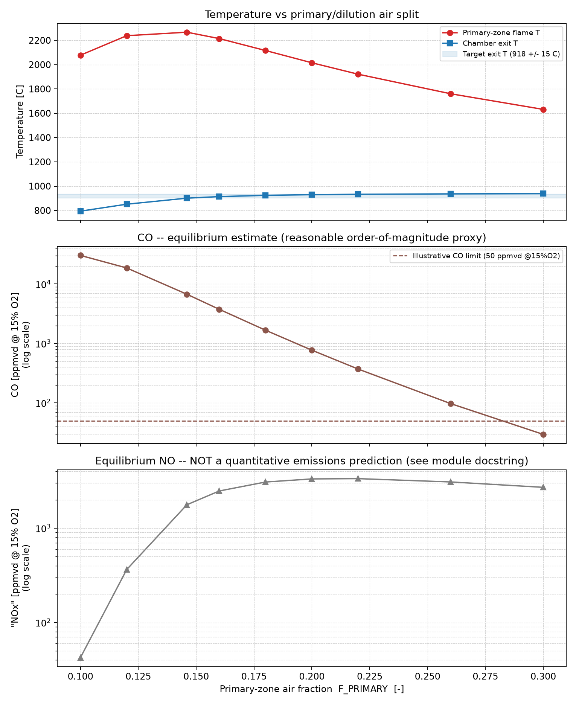

# Building a 1D combustion-chamber model

A recipe for the pattern real 1D combustor-network codes use: adiabatic
combustion, then a discretized liner built from ordinary flow and thermal
primitives — `Combustor`, `Pipe`, `Junction`, and a `Convection`/`Radiation`/
`Conduction`/`ThermalMass` chain — rather than one purpose-built component.
Worked example: a T100-class microturbine combustion chamber, split into a
primary (root) air path and a dilution air path that mixes back in downstream.

The shape:

1. create the network and the boundary source
2. split combustion air from dilution air, from an independent design rule
3. the combustor (adiabatic flame)
4. the discretized liner: hot-gas path, dilution path, wall rings
5. wire the heat paths
6. mix dilution air back in, and solve
7. compare the predicted exit temperature against the measurement
8. an engineering trade study: choosing the split under real constraints

A runnable version of this is `tests/test_combustion_chamber_workflow.py`,
which follows these steps verbatim so the guide can't drift from working
code.

> **Geometry disclaimer.** The fuel/air flow rates and the measured inlet/
> outlet temperatures below are real operating-point data. The liner
> **geometry** (diameter, length, wall thickness, material) is an
> engineering estimate for a small can-combustor of this thermal duty — no
> OEM T100 combustor geometry is publicly available. Swap in real numbers if
> you have them; nothing here should be read as a sourced spec.

---

## 1. Network and boundary source

```python
from thermowave.core import Network
from thermowave.fluids import CanteraFluid
from thermowave.components import Source

P_IN = 417_000.0             # 4.17 bar
T_IN = 587.0 + 273.15        # 587 C, compressor discharge
MDOT_AIR = 0.8                # kg/s, total air into the chamber
MDOT_FUEL = 0.0068             # kg/s, 6.8 g/s CH4
T_TARGET_OUT = 918.0 + 273.15  # 918 C, measured chamber exit

air = CanteraFluid(name="air", mechanism="gri30.yaml", composition="O2:0.21,N2:0.79")
network = Network(fluid=air)

air_src = Source(name="air_src", P=P_IN, T=T_IN, mdot=MDOT_AIR)
```

Use `CanteraFluid`, not `IdealGasFluid`, if you want the combustor's reacted
products to propagate downstream (see *Composition-aware fluid propagation*
in the README) — every discretized liner station then sees the real product
mixture's properties, not plain air's.

## 2. Split combustion air from dilution air

`F_PRIMARY` has to come from an *independent* design assumption, not from
the measured exit temperature — sizing it to force a match against the
measurement below would make the later comparison circular (fitting a free
parameter to the answer, then "checking" it against that same answer proves
nothing). The standard independent rule for a primary combustion zone is a
target equivalence ratio: primary zones are conventionally sized close to
stoichiometric (`φ≈1`) for flame stability, regardless of what the exit
temperature downstream turns out to be:

```python
from thermowave.components import Junction

AFR_STOICH_CH4 = 17.2  # kg air / kg fuel, stoichiometric methane combustion
F_PRIMARY = (MDOT_FUEL * AFR_STOICH_CH4) / MDOT_AIR  # ~0.146

splitter = Junction(
    name="splitter", n_inlets=1, n_outlets=2,
    split_fractions=[F_PRIMARY, 1.0 - F_PRIMARY],
)
```

This is derived only from the boundary inputs already in hand
(`MDOT_FUEL`, `MDOT_AIR`) plus a textbook combustion-chemistry ratio — not
from anything measured downstream of the chamber. If you have the real
hardware's primary-zone air fraction (swirler/liner-hole area ratio),
use that instead; it's a better independent input than this rule of thumb.

`Junction` with `n_inlets=1, n_outlets>1` is a pure splitter — `out0` becomes
the primary (root) air into the combustor, `out1` the dilution air that
bypasses the liner and rejoins downstream. Every outlet gets the *same*
pressure as the inlet (no drop through the junction itself); it's the two
downstream paths' own pressure drops that need to end up comparable — see
the traps section below for what happens when they don't.

## 3. The combustor

```python
from thermowave.components import Combustor

comb = Combustor(
    name="comb", PR=0.98, efficiency=1.0,
    mdot_fuel=MDOT_FUEL, fuel="CH4", mechanism="gri30.yaml",
)
```

`mdot_fuel` is given directly here (it's measured), not solved for. `efficiency=1.0`
keeps the combustor itself fully adiabatic — the wall heat loss you actually
care about is modeled explicitly by the liner in step 4/5, so leaving
`efficiency` at 1.0 avoids double-counting that loss once as a combustor-level
fudge factor and again as real `Convection`/`Radiation` to the liner.

**A real limitation, stated plainly:** `Combustor` mixes `mdot_fuel` in at the
*same* `T_in`/`P_in` as the air stream it's combusting with — there's no
separate fuel port carrying the fuel's own upstream state (e.g. 8 bar) into
the equilibrium calculation. If your fuel line's own pressure drop matters to
you, model it as a disconnected `Source`→`Valve` purely for reporting; it
won't feed back into the flame temperature here.

## 4. The discretized liner

```python
from thermowave.components import Pipe, ThermalMass
import math

D_LINER = 0.10       # m, estimated
L_LINER = 0.22       # m, estimated
N_STATIONS = 3       # matching 3 rows of dilution holes
L_SEG = L_LINER / N_STATIONS
WALL_THICKNESS = 0.0015  # m, estimated
D_ANNULUS = 0.13     # m, see the traps section for why this is NOT the
                     # physical liner-to-casing gap width

K_WALL, RHO_WALL, CP_WALL = 15.0, 8220.0, 500.0  # Hastelloy X, approximate

A_RING = math.pi * D_LINER * L_SEG        # inner surface area per ring
VOL_RING = math.pi * D_LINER * WALL_THICKNESS * L_SEG
C_RING = RHO_WALL * CP_WALL * VOL_RING     # lumped m*cp per ring
A_COND = math.pi * D_LINER * WALL_THICKNESS  # wall cross-section, axial conduction

hotgas = [Pipe(name=f"hotgas{i}", L=L_SEG, D=D_LINER, f=0.02, n_elem=1) for i in range(N_STATIONS)]
annulus = [Pipe(name=f"annulus{i}", L=L_SEG, D=D_ANNULUS, f=0.02, n_elem=1) for i in range(N_STATIONS)]
liners = [ThermalMass(name=f"liner{i}", thermal_capacitance=C_RING, T0=T_IN) for i in range(N_STATIONS)]
```

Each station is a real component pair — `hotgas[i]` carries the reacting
flow, `annulus[i]` carries the bypass air alongside it — not one `Pipe` with
`n_elem=N`. That distinction matters: `Convection`/`Radiation` endpoints are
`(component, port)` pairs resolved through `component.ports()`, which only
exposes `"in"`/`"out"` — a multi-element `Pipe`'s internal nodes aren't
addressable that way. `Pipe` also needs its own `heat_path` attribute to sit
on a live heat path at all (as opposed to a fixed `heat_loss` scalar) — that
support was added alongside this guide.

## 5. Wire the heat paths

```python
for component in (air_src, splitter, comb, *hotgas, *annulus, *liners):
    network.add_component(component)

network.connect(air_src, "out", splitter, "in0")
network.connect(splitter, "out0", comb, "in")
network.connect(splitter, "out1", annulus[0], "in")
network.connect(comb, "out", hotgas[0], "in")
for i in range(N_STATIONS - 1):
    network.connect(hotgas[i], "out", hotgas[i + 1], "in")
    network.connect(annulus[i], "out", annulus[i + 1], "in")

from thermowave.components import Conduction, Convection, Radiation

for i in range(N_STATIONS):
    network.add_heat_path(Radiation(name=f"rad{i}", a=(hotgas[i], "in"), b=liners[i], emissivity=0.7, A=A_RING))
    network.add_heat_path(Convection(name=f"conv_hot{i}", a=(hotgas[i], "in"), b=liners[i], h=80.0, A=A_RING))
    network.add_heat_path(Convection(name=f"conv_cold{i}", a=liners[i], b=(annulus[i], "in"), h=40.0, A=A_RING))
for i in range(N_STATIONS - 1):
    network.add_heat_path(Conduction(name=f"cond{i}", a=liners[i], b=liners[i + 1], k=K_WALL, A=A_COND, L=L_SEG))
```

Three paths land on each ring: flame radiation in, hot-gas convection in,
and convection *out* to the cooler dilution air running alongside it — the
real mechanism a liner wall is cooled by. `Conduction` between neighboring
rings means a hot spot at one station bleeds into its neighbors instead of
each ring being thermally isolated. `add_heat_path()` derives every sign
automatically from which endpoint each path is attached to — see the
gas-turbine guide's own heat-path section for the general mechanism.

## 6. Mix dilution air back in, and solve

```python
from thermowave.components import Sink

mixer = Junction(name="mixer", n_inlets=2, n_outlets=1)
snk = Sink(name="snk")
network.add_component(mixer)
network.add_component(snk)

network.connect(hotgas[-1], "out", mixer, "in0")
network.connect(annulus[-1], "out", mixer, "in1")
network.connect(mixer, "out0", snk, "in")

assert network.check_wiring() == []
result = network.solve(tol=1e-8, max_iter=800, damping=0.2)
```

`Sink(P=None)` (the default) is correct here: every pressure downstream of
`air_src` is already fully determined by `comb.PR` and each `Pipe`'s own
friction drop — there's no remaining pressure unknown needing a boundary
value at the far end, unlike a map-based `Turbine`'s outlet.

## 7. Compare the prediction against the measurement

Every input above — `P_IN`, `T_IN`, `MDOT_AIR`, `MDOT_FUEL`, and now
`F_PRIMARY` from the stoichiometric design rule — comes from the boundary
conditions or an independent design assumption, never from the measured
exit temperature. That's what makes this comparison meaningful instead of
circular:

```python
P_out, h_out = result.state().node("mixer.out0")
T_predicted = result.state().fluid_at("mixer.out0").temperature_ph(P_out, h_out)

print(f"predicted exit T: {T_predicted - 273.15:.1f} C")
print(f"measured exit T:  {T_TARGET_OUT - 273.15:.1f} C")
print(f"error:            {T_predicted - T_TARGET_OUT:+.1f} C")
```

With `F_PRIMARY ≈ 0.146` (the stoichiometric-primary-zone value, ~15% of
the total air to the root) this network predicts **901.5 °C** against a
measured **918 °C** — an error of **−16.5 °C** (about 2% of the absolute
temperature). That gap is a genuine result of this model's own
simplifications (bulk `h`/`A` liner cooling, no film cooling, an assumed
rather than measured liner geometry, a stoichiometric-primary-zone
assumption standing in for the machine's actual air split) — not something
to tune away by adjusting `F_PRIMARY` back toward whatever value would
close it. If you *do* have the hardware's real primary-zone air fraction,
use it in place of the stoichiometric rule above; that replaces one
independent assumption with a better one, which is different from fitting
the split to this measurement.

---

## Traps worth knowing before you debug them

### A too-small annulus diameter looks like a convergence failure, not a sizing mistake

Walking `F_PRIMARY` down from 0.20 originally failed to converge below
about 0.18 — not slowly, but *stalled at the same residual norm* regardless
of iteration budget or damping, which looks exactly like a genuine
non-convergent wiring problem. It wasn't: `D_ANNULUS` was set to the
liner-to-casing gap's physical width (0.02 m), and at low `F_PRIMARY` the
annulus carries ~80% of 0.8 kg/s through that tiny cross-section — working
out to roughly **1200 m/s**, hypersonic, in a component whose friction model
assumes ordinary duct flow. `D_ANNULUS` needs to be sized as an *equivalent
circular flow area* for a sane duct velocity (here, ~30 m/s), not as the
literal physical gap — the same "use an equivalent diameter for a
non-circular passage" trick as any duct hydraulics. A stalled-at-identical-
residual failure that doesn't improve with more iterations or lower damping
is a strong signal to check for exactly this kind of unphysical velocity
before assuming the network's wiring is wrong.

### Junction doesn't reconcile mismatched branch pressures

`Junction`'s merge takes its reference pressure from the *first* inlet only
(`in0`) and silently ignores whatever pressure `in1` actually arrived at —
documented behavior, not a bug, but worth knowing before you rely on the two
branches "meeting in the middle." Keep the hot-gas path's total pressure
drop (`comb.PR` × 3 friction drops) and the dilution path's (3 friction
drops alone) in the same ballpark by design, the way a real combustor's
liner and annulus are sized to have comparable pressure loss — otherwise the
mixer's reported exit pressure quietly reflects only one branch.

### Liner temperatures come out far hotter than a real metal survives

This model's rings settle in the 2500 K range at this operating point —
well past any real liner alloy's limit. That's a real, expected
consequence of what this model does and doesn't include: bulk `h`/`A`
convection with no **film cooling** (the thin layer of cool air a real liner
hugs its hot-side wall with, which drops the *local* gas temperature the
wall actually sees, not just the bulk convective coefficient). Radiative
heat scales as `T^4`, so at flame temperatures it dominates the wall's
energy balance unless the cold-side conductance is far larger than the bulk
values here. Treat this model as the right *mechanism* (radiation +
convection + conduction, discretized station by station) demonstrated at
teaching-model fidelity, not a liner life-prediction tool — a real film-
cooling effectiveness factor (reducing the effective driving temperature the
wall sees, not just raising `h`) is the standard fix if you need believable
liner metal temperatures.

---

## Engineering trade study: choosing `F_PRIMARY` under real constraints

Everything up to step 7 picked one `F_PRIMARY` (from an independent design
rule) and looked at what it predicts. A real design decision is the reverse
question: **which `F_PRIMARY` should we actually build**, given more than
one thing has to be satisfied at once? Here, two real constraints:

1. **Chamber exit temperature** within `918 °C ± 15 °C` — the measured/
   design turbine-inlet condition. Too low wastes capacity; too high erodes
   turbine hot-section life.
2. **CO emissions** under an illustrative regulatory-style limit of
   `50 ppmvd @ 15% O₂` — the standard *dry, oxygen-corrected* convention
   real gas-turbine emissions are reported in, not a raw (and dilution-
   diluted) mole fraction. See `dry_ppmvd_at_15pct_o2()` in the script below
   for the conversion.

The full sweep, constraints, and plot live in
[`combustion_chamber_trade_study.py`](combustion_chamber_trade_study.py)
(same repo folder as this guide) — run it directly:

```bash
python docs/tutorials/combustion_chamber_trade_study.py
```

```
 F_PRIMARY  T_exit[C]  T ok?   CO[ppmvd15]  CO ok?
--------------------------------------------------
     0.100      794.3     no       30206.5      no
     0.120      851.6     no       18593.5      no
     0.146      901.3     no        6724.5      no
     0.160      914.1    yes        3749.4      no
     0.180      924.4    yes        1669.2      no
     0.200      930.0    yes         771.1      no
     0.220      933.2     no         371.3      no
     0.260      936.5     no          97.4      no
     0.300      938.3     no          29.6     yes

No single F_PRIMARY in this sweep meets both the temperature band and the
CO limit.
```



**No single split satisfies both constraints, and that's the real finding,
not a bug to fix by widening the sweep.** Hitting the temperature band
needs a rich-ish primary zone (`F_PRIMARY ≈ 0.16–0.20`), which leaves CO in
the hundreds-to-thousands of ppm — the mixture simply doesn't have enough
local O₂ to finish burning. Getting CO under the limit needs a much leaner
primary zone (`F_PRIMARY ≈ 0.30`), which overshoots the temperature target
by ~20 °C because there's correspondingly less dilution air left to cool
the exit down. With this model's fixed 3-station, single-scalar-split
geometry, temperature and CO aren't independently tunable — which is
exactly why real annular combustors use *multiple staged dilution rows*
and deliberate primary-zone geometry instead of one lump air split. The
honest recommendation here is a compromise near `F_PRIMARY ≈ 0.18–0.20`
(closest simultaneous balance of the two), with the real fix being liner
redesign (more stations, staged dilution), not further retuning this one
number.

**The NOx panel is intentionally not part of the pass/fail logic.**
Equilibrium chemistry — the same mechanism `Combustor` already uses for
`T_out` — has no notion of finite-rate kinetics or flame residence
time/quenching, so it overpredicts real engine NOx by roughly 2–3 orders of
magnitude (thousands of ppm here vs. tens of ppm on an actual small gas
turbine). CO happens to survive close to its equilibrium value reasonably
well in practice, which is why it's usable as an order-of-magnitude design
proxy above; NOx does not, and treating the NOx numbers as a compliance
prediction would be a real mistake. An actual NOx prediction needs a
finite-rate reactor-network model (a perfectly-stirred-reactor + plug-flow
chain in Cantera, say) or an empirical correlation fitted to test data —
outside what this package's equilibrium `Combustor` gives you.

---

## Reading results

```python
state = result.state()
P_out, h_out = state.node("mixer.out0")
print(state.fluid_at("mixer.out0").temperature_ph(P_out, h_out))  # chamber exit T
for liner in liners:
    print(liner.name, state.param(f"{liner.name}.T"))             # per-station wall T
```
